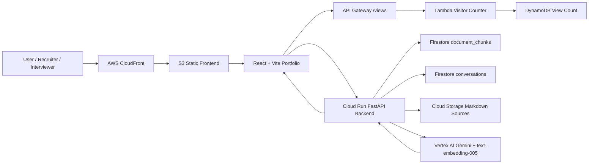
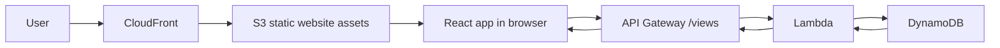
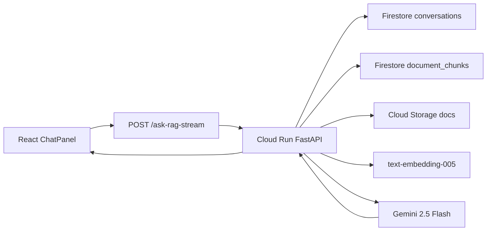
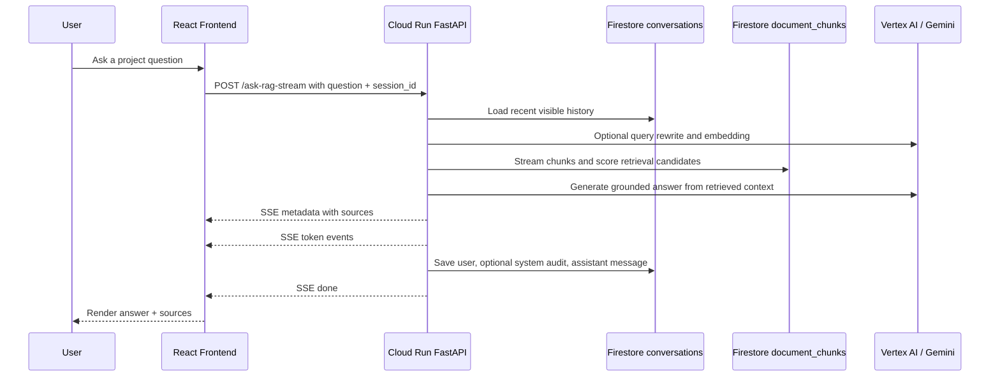

# Multi-Cloud AI Portfolio Assistant 工程技術文件

Google Docs 版技術說明文件｜根據目前 repo Markdown、frontend-AWS、backend-GCP 與 GitHub Actions 內容整理

## 1. 背景與動機

本專案從 Cloud Resume Challenge 與 AWS Cloud Engineer 轉職學習路線出發。傳統履歷可以列出技能，但很難完整呈現雲端資源、前後端整合、部署流程、除錯紀錄與架構取捨。因此，專案一開始以 AWS 雲端履歷網站與 serverless visitor counter 作為可驗證的實作起點。

在後續迭代中，專案從靜態作品集演進成互動式 AI Portfolio。訪客不只可以閱讀頁面上的專案說明，也可以透過 AI Assistant 用自然語言詢問架構、部署、RAG、troubleshooting 與技術決策。

### 1.1 背景故事

我正在學習雲端技術並轉職 AWS Cloud Engineer。專案起點是 Cloud Resume Challenge：先建立可部署、可公開訪問、可被驗證的雲端履歷網站，再逐步加入真實工程功能。

### 1.2 問題發現

- 靜態履歷缺乏互動性，無法直接展示雲端系統如何運作。
- GitHub、技術文件、部署紀錄與作品集內容分散，面試官需要自行拼出完整脈絡。
- 傳統作品集通常只展示結果畫面，較難呈現 root cause 分析、CORS、Cloud Run revision、CI/CD env var 等工程細節。
- 求職者很難只靠履歷條列展現 cloud engineering、backend、frontend、AI/RAG 與 troubleshooting 的整合能力。

### 1.3 解決方案

- 建立 React + Vite portfolio website，並透過 AWS S3 + CloudFront 對外提供 HTTPS/CDN 存取。
- 加入 AWS serverless visitor counter：frontend 呼叫 API Gateway endpoint，由 Lambda 與 DynamoDB 處理瀏覽次數。
- 導入 GCP Cloud Run FastAPI backend 作為 AI/RAG backend，使用 Gemini、Firestore 與 Cloud Storage 建立可查詢的知識庫。
- AI Assistant 以 `/ask-rag-stream` 作為主要路徑，支援 streaming response、來源 metadata 與 `/ask-rag` fallback。

### 1.5 AWS Account Migration Note

原 AWS account 已不可用。S3、CloudFront、Lambda、API Gateway、DynamoDB 曾經部署並可運作，這些紀錄應保留為 historical evidence；但在 new AWS account 完成 rebuild/redeploy 前，不應描述為 currently deployed infrastructure。New AWS account rebuild scope 包含 S3、CloudFront、Lambda、API Gateway、DynamoDB、SNS、EventBridge、IAM roles and policies、CI/CD deployment integration。

### 1.4 啟發與動機

這個專案的重點不是把所有雲端服務堆在一起，而是把一個原本單一 AWS Cloud Resume 專案，演進成可以展示 Multi-Cloud、AI Engineering、Backend API、Frontend UX、部署流程與實際除錯能力的工程作品。

## 2. 系統概覽

### 2.1 專案介紹

Multi-Cloud AI Portfolio Assistant 是一個雲端工程作品集平台。前端 portfolio 部署於 AWS 靜態網站/CDN 路徑，visitor counter 使用 AWS serverless 架構；AI assistant 則使用 GCP Cloud Run 上的 FastAPI backend，透過 Firestore 中的 document chunks、conversation history 與 Vertex AI Gemini 產生 grounded answers。

### 2.2 核心功能

| 功能 | 說明 | 使用技術 |
| --- | --- | --- |
| Portfolio Website | 公開展示個人背景、技能、作品集與 capstone project。 | React, Vite, JavaScript, CSS, S3, CloudFront |
| Visitor Counter | Previous AWS implementation 已驗證；new AWS account 需重建 `/views` endpoint。 | API Gateway, Lambda, DynamoDB |
| AI Assistant | 讓訪客以自然語言詢問專案內容與架構。 | React ChatPanel, Cloud Run, FastAPI, Gemini |
| RAG Knowledge Base | 將專案 markdown 文件切 chunk、產生 embedding、存入 Firestore 後檢索。 | GCS, Firestore, text-embedding-005, cosine similarity |
| Conversation History | 以 `session_id` 保存 user/assistant 對話，用於 follow-up context。 | Firestore `conversations/{session_id}/messages/{message_id}` |
| Streaming Response | AI 回答以 SSE metadata/token/done/error 事件逐步回傳。 | POST `/ask-rag-stream`, ReadableStream, Server-Sent Events |

### 2.3 技術棧

| 分類 | 技術 | 用途 |
| --- | --- | --- |
| Frontend | React 19, Vite 8, JavaScript, CSS | Portfolio UI、bilingual content、theme、modal、AI assistant。 |
| AWS | S3, CloudFront, API Gateway, Lambda, DynamoDB | 靜態網站託管/CDN/HTTPS 與 visitor counter serverless path。 |
| GCP | Cloud Run, Cloud Storage, Firestore, Artifact Registry | RAG backend hosting、文件來源、chunk/conversation 儲存與 container deployment。 |
| Backend | Python 3.11, FastAPI, Uvicorn | API routes、RAG orchestration、health checks、streaming response。 |
| AI/RAG | Gemini 2.5 Flash, text-embedding-005 | 回答生成、embedding、retrieval context 建立。 |
| Database | Firestore, DynamoDB | RAG chunks/conversations 與 visitor count。 |
| DevOps | GitHub Actions, Docker, gcloud, AWS CLI | frontend S3 sync/CloudFront invalidation 與 backend Cloud Run deployment。 |

## 3. 架構設計

### 3.1 使用者服務藍圖

1. 使用者進入 CloudFront 提供的 Portfolio Website。
2. 使用者查看 portfolio、capstone card，以及以 Docusaurus/GitBook-style sidebar 呈現的 project documentation portal。
3. Frontend 呼叫 AWS API Gateway `/views` endpoint 取得 visitor count。
4. 使用者開啟 AI Assistant 並輸入專案問題。
5. Frontend 先呼叫 GCP Cloud Run backend 的 `/ask-rag-stream`。
6. Backend 讀取 Firestore conversation history，視設定執行 query rewriting，產生 embedding 並檢索 Firestore `document_chunks`。
7. Gemini 根據 retrieved context 產生回答，frontend 逐步顯示 streaming tokens 與 sources。

### 3.2 AWS 與 GCP 整體架構圖



### 3.2.1 AWS 架構圖

AWS 負責 portfolio delivery、visitor counter，以及後續 event-driven notification roadmap。Previous AWS account 曾部署 portfolio delivery 與 visitor counter；new AWS account 需要重建 S3、CloudFront、API Gateway、Lambda、DynamoDB、SNS、EventBridge、IAM 與 CI/CD integration。Frontend build output 位於 `frontend-AWS/dist/`，GitHub Actions workflow 可重用 `aws s3 sync dist/ s3://... --delete` 與 CloudFront invalidation，但必須先重新配置 new-account resources and secrets。



### 3.2.2 GCP 架構圖

GCP 負責 AI/RAG backend。Cloud Run 執行 FastAPI service，讀取 Cloud Storage 中的 markdown 文件，將 chunks 與 embeddings 寫入 Firestore，並用 Gemini 2.5 Flash 產生回答。



### 3.3 系統模組圖

| 模組 | 責任 | 主要檔案或服務 |
| --- | --- | --- |
| Frontend UI | Portfolio、navbar、modal、AI assistant、language/theme state。 | `frontend-AWS/src/pages/Home.jsx`, `components/`, `hooks/` |
| AWS Visitor Counter | 取得與顯示瀏覽次數。 | `frontend-AWS/src/api/visitors.js`, API Gateway, Lambda, DynamoDB |
| GCP AI Backend | API routing、CORS、health、RAG orchestration、streaming。 | `backend-GCP/main.py`, `app/routes/`, Cloud Run |
| RAG Retrieval Layer | chunking、embedding、cosine similarity、hybrid scoring、reranking。 | `app/services/vector_service.py`, `rag_service.py` |
| Conversation Storage | 保存 session-based user/assistant messages 與 query-rewrite audit。 | Firestore `conversations/{session_id}/messages/{message_id}` |
| Document Storage | 保存 source markdown documents 並提供 ingestion 來源。 | Cloud Storage bucket `cloud-resume-ai-rag-docs` |

### 3.4 資料流程圖



## 4. 實作流程

### 4.1 AWS 前後端

前端實作位於 `frontend-AWS/`，使用 `npm run build` 產出 `dist/`。部署 workflow 會安裝 dependencies、建立 `.env`、build frontend、同步到 S3，最後 invalidates CloudFront cache。

Visitor counter 的 frontend integration 已確認在 `frontend-AWS/src/api/visitors.js`，呼叫 `https://9u8ml80foj.execute-api.ap-northeast-1.amazonaws.com/views` 並讀取 response 的 `views` 欄位。

- Lambda function 原始碼：To Confirm，目前 repo 中未找到 visitor counter Lambda implementation。
- DynamoDB table name 與 key schema：To Confirm，目前 repo 文件只確認使用 DynamoDB 與 `/views` response。
- IAM policy 細節：To Confirm，目前 repo 中未找到 AWS IAM policy 或 IaC 定義。

### 4.2 GCP AI Backend

Cloud Run backend 位於 `backend-GCP/`，Dockerfile 使用 `python:3.11-slim`，安裝 `requirements.txt` 後以 `uvicorn main:app --host 0.0.0.0 --port ${PORT}` 啟動。GitHub Actions 會 build Docker image、push 到 Artifact Registry，並透過 `gcloud run deploy` 部署。

FastAPI routes 分為 health、chat 與 rag 三類。`/ask-rag-stream` 使用 `StreamingResponse` 回傳 `text/event-stream`；`/ingest-docs` 受 `X-Admin-Token` 保護。

| Endpoint | 用途 | 確認來源 |
| --- | --- | --- |
| GET `/` | Health/config summary/startup warnings。 | `app/routes/health.py` |
| GET `/healthz` | 輕量 uptime health check。 | `app/routes/health.py` |
| POST `/chat` | Basic Gemini chat，不使用文件 retrieval。 | `app/routes/chat.py` |
| POST `/chat-with-docs` | 讀取指定 GCS markdown 作為 direct context。 | `app/routes/chat.py` |
| POST `/ingest-docs` | Admin-only 文件切 chunk、embedding、寫入 Firestore。 | `app/routes/rag.py`, `ingestion_service.py` |
| POST `/ask-rag` | 同步 RAG answer，回傳 answer、sources、session_id。 | `app/routes/rag.py`, `rag_service.py` |
| POST `/ask-rag-stream` | Streaming RAG answer，回傳 metadata/token/done/error SSE。 | `app/routes/rag.py`, `rag_service.py` |

### 4.3 RAG AI Assistant

1. 文件來源：Cloud Storage bucket `cloud-resume-ai-rag-docs` 保存 markdown source documents；production notes 指出曾以 `CAPSTONE_PROJECT_STATE.md` 重建 index。
2. Chunking：`vector_service.chunk_text` 先依 Markdown headings 分段，再依 paragraph boundary 切分，最後才使用 size fallback。
3. Embedding：`gemini_service.embed_text` 使用 `text-embedding-005` 產生 query 與 chunk embeddings。
4. Retrieval：backend 目前 stream Firestore `document_chunks`，計算 cosine similarity，可選擇 hybrid keyword scoring、candidate pool、score threshold 與 deterministic reranking。
5. Response Generation：`rag_service` 將 top chunks 格式化為 `[S1]`, `[S2]` source context，要求 Gemini 的 factual claims 使用 source ID citations。
6. Persistence：backend 以 `session_id` 保存 user/assistant messages；query rewrite 若實際使用，會另存 `role: system`, `event_type: query_rewrite` 的 audit message。

## 5. 部署與維運

### 5.1 Frontend Deployment

1. GitHub Actions push to `main` 觸發 `Deploy Frontend to AWS` workflow。
2. Node.js 20 setup，使用 `npm ci` 安裝 dependencies。
3. 寫入 `VITE_GCP_RAG_API_URL` 到 `.env`；若 secret 未提供，fallback 到目前 Cloud Run backend URL。
4. 執行 `npm run build`。
5. 使用 AWS credentials 透過 `aws s3 sync dist/ s3://... --delete` 部署。
6. 透過 `aws cloudfront create-invalidation --paths "/*"` 清除 CDN cache。

### 5.2 Backend Deployment

1. GitHub Actions push to `main` 且 path 符合 `backend-GCP/**` 或 backend workflow 時觸發。
2. 透過 Google Workload Identity Federation 驗證到 GCP。
3. Build Docker image 並 push 到 Artifact Registry。
4. 用 `gcloud run deploy` 部署 Cloud Run，設定 CORS、INGESTION_ADMIN_TOKEN 與 query rewrite env vars。
5. 目前 workflow 中 `RAG_QUERY_REWRITE_ENABLED` 設為 `false`，代表 query rewriting 功能已實作但 deployment 預設未啟用。

### 5.3 Logging

Backend 已加入 JSON-formatted stdout logs、request IDs、request duration logs 與 service boundary metadata logs。Cloud Run 可透過 Cloud Logging 查詢這些 stdout/stderr logs。

Lambda logs 應位於 CloudWatch Logs，但 repo 中沒有 Lambda 原始碼或 CloudWatch log group 設定；具體 log group name 為 To Confirm。

### 5.4 Monitoring

目前已有 health endpoints、startup warnings、structured logging 與部分 request duration header。完整 monitoring dashboard、analytics、alerting 尚未完成，文件與 roadmap 均將其列為 future improvement。

## 6. 問題排除與技術決策

### 6.1 問題排除紀錄

| 問題 | Root Cause | 解決方式 | Lesson Learned |
| --- | --- | --- | --- |
| Production CloudFront AI assistant failed | Cloud Run CORS allowed localhost origins but missed the production CloudFront origin. | Added `https://dvzu3s2gq6iw.cloudfront.net` to backend CORS defaults and deployment env vars; added regression test. | Production browser failures can look like generic fetch errors; verify CORS preflight directly. |
| Backend deploy failed after adding CORS env var | `gcloud --set-env-vars` parsed comma-separated CORS origins as multiple key/value pairs. | Used custom delimiter syntax: `--set-env-vars "^|^CORS_ALLOWED_ORIGINS=..."`. | Comma-bearing env vars need explicit delimiter handling in gcloud deploy commands. |
| Firestore conversations did not appear after feature work | Cloud Run was still serving an older revision. | Redeployed backend and verified active revision plus Firestore writes. | Check serving revision before debugging application logic. |
| RAG content was stale/incomplete in V1 | Indexed source content did not reflect current multi-cloud architecture. | Updated GCS source to `CAPSTONE_PROJECT_STATE.md`, cleared stale chunks, and rebuilt index through `/ingest-docs`. | RAG correctness depends on source freshness, not only prompt quality. |
| Streaming fallback behavior | Streaming can fail due to network/CORS/backend issues. | Frontend tries `/ask-rag-stream` first and preserves `/ask-rag` fallback. | Fallback paths help keep UX resilient while enabling streaming. |
| DynamoDB reserved word issue | To Confirm: not found in current repo Markdown or source files. | To Confirm. | Do not include this as a confirmed incident until the exact evidence is added. |
| Vertex AI permission issue | To Confirm: not found as a documented incident in current repo files. | To Confirm. | Permission troubleshooting should be documented with exact error text when it occurs. |

### 6.2 技術決策分析

| 技術決策 | 替代方案 | 選擇原因 | Trade-off |
| --- | --- | --- | --- |
| AWS S3 + CloudFront | EC2/Nginx, Amplify, Vercel | 適合 static portfolio，成本低，CDN/HTTPS 直觀，符合 Cloud Resume Challenge。 | 動態行為需另外接 API；cache invalidation 需要部署流程處理。 |
| API Gateway + Lambda + DynamoDB | Container backend, EC2, RDS | serverless visitor counter 簡潔、可展示 AWS event-driven pattern。 | Lambda/DynamoDB implementation details 目前未在 repo 中保存，後續可補 IaC 與 source。 |
| Cloud Run | Cloud Functions, GKE, Lambda | FastAPI container 部署彈性高，適合 Python RAG backend 與 streaming endpoint。 | 需要管理 container build、env vars、service account 與 CORS。 |
| Vertex AI / Gemini | OpenAI API, Bedrock, self-hosted model | GCP pivot 讓 RAG backend 可較快完成 end-to-end deployed path。 | 原 AWS Bedrock RAG 路線被 deferred，multi-cloud 故事需要清楚說明取捨。 |
| Firestore | Cloud SQL, BigQuery, vector DB | 簡化 document chunks 與 session conversation persistence。 | 目前 retrieval 仍 full scan in memory，長期應升級 managed vector search。 |
| Multi-Cloud | AWS-only, GCP-only | AWS 展示 serverless fundamentals，GCP 展示 AI/RAG engineering，形成更完整作品集。 | 部署、CORS、文件與監控複雜度上升。 |
| Terraform / full CI/CD 尚未完全導入 | 手動部署或只用 GitHub Actions | 目前 repo 已有 GitHub Actions deployment，但基礎設施 IaC 尚未完整落地。 | 短期可快速迭代；長期 reproducibility 與 auditability 仍需 Terraform/IaC 補強。 |

## 7. 未來規劃

### 7.1 Terraform Infrastructure as Code

將 AWS S3、CloudFront、API Gateway、Lambda、DynamoDB、SNS、EventBridge、IAM deployment roles，以及 GCP Cloud Run、Artifact Registry、Firestore、GCS、IAM/service account 模組化管理。AWS 採 new-account rebuild-first；GCP 對 verified existing resources 採 import-first。

### 7.1.1 Confirmed Portfolio Roadmap

1. AWS Cloud Resume Challenge + GCP RAG Capstone
2. Event-Driven Notification System
3. URL Shortener
4. QR Code Generator
5. Real-Time Chat Application
6. Video Streaming Platform

### 7.2 GitHub Actions CI/CD

Frontend/backend deployment workflows 已存在。下一步可加入 pull request checks、RAG evaluation gate、deployment smoke tests、Cloud Run revision verification 與 rollback notes。

### 7.3 Vector Search

目前 Firestore chunks 是 in-memory full scan retrieval。未來可評估 Firestore Vector Search 或 Vertex AI Vector Search，將 retrieval 升級為 production-style ANN vector index。

### 7.4 Monitoring 與 Alerting

使用 Cloud Logging / Cloud Monitoring 建立 request latency、error rate、RAG source usage、streaming error、Firestore read volume、Cloud Run revision health 等 dashboard 與 alerts。

### 7.5 Production Hardening

- Authentication：保護管理端與 ingestion path，目前 `/ingest-docs` 已有 admin token。
- Rate limiting：避免 public assistant 被濫用或造成成本暴增。
- Better error handling：保留 controlled JSON/SSE errors，並增加 user-friendly classification。
- Security hardening：補充 IAM least privilege、secret rotation、CORS origin review。
- Cost monitoring：追蹤 Cloud Run、Vertex AI、Firestore reads、CloudFront 與 API Gateway 成本。

## 8. 技能總結

| 能力分類 | 對應技術 | 專案中如何體現 |
| --- | --- | --- |
| Cloud Engineering | AWS, GCP, Cloud Run, S3, CloudFront | 將 portfolio delivery、serverless counter 與 AI backend 拆成可部署的 cloud paths。 |
| Serverless Architecture | API Gateway, Lambda, DynamoDB, Cloud Run | visitor counter 與 containerized FastAPI backend 都使用 managed/serverless execution model。 |
| AI Engineering | Gemini, text-embedding-005, RAG | 實作 chunking、embedding、retrieval、source citations、streaming generation。 |
| Backend Development | FastAPI, Python services/routes/schemas | 將 backend 拆成 config、schemas、routes、services，保留 `main:app` entrypoint。 |
| Frontend Development | React, Vite, hooks, components | 模組化 portfolio UI、assistant streaming parsing、modal layout 與 bilingual content。 |
| DevOps | GitHub Actions, Docker, gcloud, AWS CLI | 自動 build/deploy frontend 與 backend，處理 env vars 與 CloudFront invalidation。 |
| Security | CORS, admin token, secrets | 修正 production CORS，保護 `/ingest-docs`，使用 GitHub secrets 傳入 deployment env vars。 |
| Troubleshooting | CORS preflight, Cloud Run revisions, regression tests | 以 exact evidence 找到 live AI assistant failure root cause 並補測試。 |
| Technical Documentation | Statement_MD, test records, development logs | 持續記錄 project state、RAG evolution、frontend changes、production incidents。 |

## 9. 附錄

### 9.1 API Endpoints

| Endpoint | Method | 用途 |
| --- | --- | --- |
| AWS `/views` | GET | Visitor count endpoint; frontend reads `views`. |
| GCP `/` | GET | Backend health/config summary. |
| GCP `/healthz` | GET | Lightweight health check. |
| GCP `/chat` | POST | Basic Gemini chat. |
| GCP `/chat-with-docs` | POST | Direct GCS document context chat. |
| GCP `/ingest-docs` | POST | Admin-only ingestion into Firestore. |
| GCP `/ask-rag` | POST | Synchronous RAG answer. |
| GCP `/ask-rag-stream` | POST | Streaming RAG answer via SSE. |

### 9.2 Firestore Schema

```text
document_chunks/{deterministic_sha256(file_name:chunk_index)}
  file_name: string
  chunk_index: number
  chunk_text: string
  embedding: number[]
  content_hash: string
  char_count: number
  heading: string | null
  ingestion_key: string
  updated_at: server timestamp

conversations/{session_id}
  updated_at: server timestamp
  last_request_id: string | null

conversations/{session_id}/messages/{message_id}
  role: "user" | "assistant" | "system"
  content: string
  created_at: server timestamp
  request_id: string | optional
  event_type: "query_rewrite" | optional
  original_question: string | optional
  rewritten_query: string | optional
  rewrite_used: boolean | optional
```

### 9.3 DynamoDB Schema

To Confirm：目前 repo 文件與 frontend code 確認 visitor counter 使用 DynamoDB，且 `/views` response 回傳 `{ "views": number }`，但未找到 table name、partition key、attribute names 或 Lambda update expression。建議補上 Lambda source、IaC 或手動設定截圖/紀錄。

### 9.4 Environment Variables

| 變數 | 位置 | 用途 |
| --- | --- | --- |
| `VITE_GCP_RAG_API_URL` | frontend-AWS `.env` / GitHub secret | Frontend RAG backend base URL；缺省 fallback 到 Cloud Run URL。 |
| `CORS_ALLOWED_ORIGINS` | Cloud Run env | 允許 localhost 與 production CloudFront origin。 |
| `INGESTION_ADMIN_TOKEN` | Cloud Run env / GitHub secret | 保護 `/ingest-docs`。 |
| `RAG_QUERY_REWRITE_ENABLED` | Cloud Run env | 控制 query rewrite；目前 workflow 設為 `false`。 |
| `RAG_QUERY_REWRITE_HISTORY_LIMIT` | Cloud Run env | query rewrite 使用的 recent history 筆數。 |
| `RAG_QUERY_REWRITE_MODEL` | Cloud Run env | query rewrite model，預設 `gemini-2.5-flash`。 |
| `GOOGLE_CLOUD_PROJECT` | Cloud Run env | Firestore/GCP client project config。 |
| `GOOGLE_CLOUD_LOCATION` | Cloud Run env | Vertex AI location；settings default 為 `us-central1`。 |
| `DOCS_BUCKET` | Cloud Run env | GCS markdown source bucket，default `cloud-resume-ai-rag-docs`。 |
| `INGEST_DOCUMENTS` | Cloud Run env | ingestion source list；settings default 仍為 `PROJECT_STATE.md,Frontend_Development_Log.md`。 |
| `DIRECT_CONTEXT_DOCUMENTS` | Cloud Run env | `/chat-with-docs` source list；settings default 仍為 `PROJECT_STATE.md,Frontend_Development_Log.md`。 |
| `RAG_TOP_K`, `RAG_CANDIDATE_POOL_SIZE`, `RAG_SCORE_THRESHOLD` | Cloud Run env | retrieval result count、candidate pool 與 threshold。 |

### 9.5 Repository Structure

```text
.
├── Statement_MD/
│   ├── CAPSTONE_PROJECT_STATE.md
│   ├── CAPSTONE_V1_TEST_RECORD.md
│   ├── GCP_RAG_DEVELOPMENT_LOG.md
│   ├── GCP_RAG_PROJECT_STATE.md
│   └── REACT_Frontend_Development_Log.md
├── frontend-AWS/
│   ├── src/api/
│   ├── src/components/
│   ├── src/content/
│   ├── src/hooks/
│   └── src/pages/
├── backend-GCP/
│   ├── app/config/
│   ├── app/routes/
│   ├── app/schemas/
│   ├── app/services/
│   ├── Dockerfile
│   └── main.py
└── .github/workflows/
    ├── deploy-frontend.yml
    └── deploy-backend-gcp.yml
```

### 9.6 To Confirm 清單與不一致處理

- AWS Lambda visitor counter source、DynamoDB table schema、IAM policy details 未在目前 repo 找到。
- DynamoDB reserved word incident 與 Vertex AI permission incident 未在目前 repo 文件中找到具體證據。
- `CAPSTONE_PROJECT_STATE.md` 與 `REACT_Frontend_Development_Log.md` 仍有部分 `frontend-Vite` 路徑，但目前 active app 與 workflow 是 `frontend-AWS`。
- `frontend-AWS/src/content/portfolioContent.js` 已更新為 GCP Cloud Run + Gemini + Firestore + GCS 的 current RAG path；Bedrock/S3 Vectors 應只保留在 historical pivot context。
- `backend-GCP/app/config/settings.py` default `INGEST_DOCUMENTS` / `DIRECT_CONTEXT_DOCUMENTS` 仍是 `PROJECT_STATE.md,Frontend_Development_Log.md`，但 production docs 說明目前 ingestion source 曾調整為 `CAPSTONE_PROJECT_STATE.md`；backend deployment workflow 沒有顯式設定這兩個 env vars。
- Query rewriting 已在 code 中實作，但 `.github/workflows/deploy-backend-gcp.yml` 目前設定 `RAG_QUERY_REWRITE_ENABLED: "false"`，文件應描述為 available/implemented but disabled by current deploy config。
