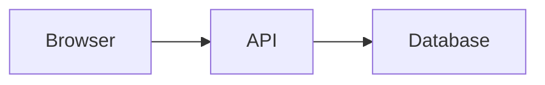

# Markdown Authoring Guide

This guide documents the supported markdown blocks for project documentation files under:

```text
frontend-AWS/src/content/projects/<project-slug>/<language>/
```

Each project should normally provide:

```text
overview.md
architecture.md
implementation.md
```

The documentation modal loads and parses only the selected active document.

## Required Structure

Each document should include frontmatter, one document title, and at least one
sidebar section.

```md
---
title: Implementation
---

# Implementation

## Frontend

Content goes here.
```

## Heading Rules

Always follow standard Markdown syntax. A heading marker must be followed by a
space.

Valid:

```md
# Overview

## Project Summary

### Detail
```

Invalid:

```md
#Overview

##Project Summary

###Detail
```

Use one `#` heading as document title metadata only; it is not rendered as a
visible body heading in the modal. Only valid `##` headings become sidebar
section buttons. Use `###` and deeper headings inside content only.

Common mistake:

```md
---
title: Implementation
---

Content without any ## section heading.
```

This still renders as document-level content, but it does not create a sidebar
section button and the parser logs a markdown warning.

## Mermaid

Use fenced `mermaid` blocks.

````md

````

Common mistakes:

````md
```mermaid
flowchart LR
  Browser --> API
````

The closing fence is missing.

````md
```mermaid
flowchart LR
  Browser --
```
````

The fence is closed, but Mermaid syntax is invalid. The frontend shows a fallback block with the Mermaid source.

## Gallery

Use fenced `gallery` blocks. Put one image per line. Add an optional caption after `|`.

````md
```gallery
/project-images/example-1.png | Architecture overview
/project-images/example-2.png | Deployment result
```
````

Common mistakes:

````md
```gallery
/project-images/missing-image.png | Missing file example
```
````

The document continues rendering. The missing image tile shows `Image Not Found` and logs a warning.

````md
```gallery
/project-images/example.png | Missing closing fence
````

The parser logs a warning and skips the broken gallery block.

## Images

Use standard markdown image syntax.

```md

```

Common mistake:

```md

```

The image frame shows `Image Not Found` and the rest of the document continues rendering.

## Callouts

Use supported custom callout blocks.

```md
::: warning Deployment Note
Check CloudFront cache behavior before validating API route changes.
:::
```

Supported callout types:

- `note`
- `info`
- `tip`
- `warning`
- `danger`
- `success`
- `aws`
- `gcp`

Common mistakes:

```md
::: warning Deployment Note
Missing closing marker.
```

The parser logs a warning and skips the broken callout block.

```md
::: custom Unsupported Type
This renders as a note and logs a warning.
:::
```

## Tables

Use a standard markdown table with a separator row.

```md
| Layer | Service |
| --- | --- |
| Frontend | React |
| Backend | FastAPI |
```

Common mistake:

```md
| Layer | Service |
| Frontend | React |
```

The parser logs a warning for an invalid table block and continues.

## Code Blocks

Use fenced code blocks with an optional language.

````md
```bash
npm run build
```
````

Common language labels such as `bash`, `css`, `html`, `js`, `json`, `jsx`, `md`, `python`, `text`, and `yaml` are displayed in the code block header.

Common mistakes:

````md
```bash
npm run build
````

The closing fence is missing. The parser logs a warning and skips the broken block.

````md
```123
invalid fence language
```
````

Fence languages should begin with a letter. Invalid block syntax is skipped with a warning.

## Debug Warnings

Warnings use this format:

```text
[Markdown Warning]
Unclosed mermaid block in architecture.md
```

Other examples:

```text
[Markdown Warning]
Gallery image missing:
/project-images/example.png
```

```text
[Markdown Warning]
Invalid markdown block detected in implementation.md
```
