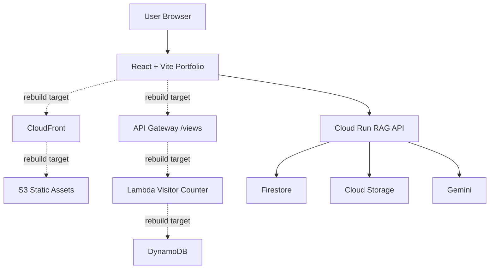
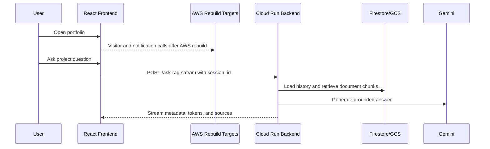

# Architecture

## Architecture Overview
The target architecture keeps the portfolio frontend and visitor/event workloads on AWS while routing assistant questions to a GCP Cloud Run backend for retrieval and grounded answer generation. The AWS side was previously deployed in the original account and must be rebuilt in the new AWS account before it should be described as currently deployed.

:::aws
Previous state: S3, CloudFront, API Gateway, Lambda, and DynamoDB existed and were operational in the original AWS account.
:::

:::gcp
RAG requests are handled by Cloud Run, Firestore, Cloud Storage, and Gemini.
:::

```gallery
/project-images/AWS-Cloud-Project.png | AWS cloud project visual reference
```

## Main Components
| Layer | Service or Component |
| --- | --- |
| Frontend Layer | React |
| Frontend Layer | Vite |
| Frontend Layer | S3 |
| Frontend Layer | CloudFront |
| AWS Serverless Layer | API Gateway |
| AWS Serverless Layer | Lambda |
| AWS Serverless Layer | DynamoDB |
| GCP AI Backend Layer | Cloud Run |
| GCP AI Backend Layer | Firestore |
| GCP AI Backend Layer | Cloud Storage |
| GCP AI Backend Layer | Vertex AI Gemini |
| Planned AWS Events Layer | EventBridge |
| Planned AWS Events Layer | SNS |
| Planned AWS Events Layer | IAM roles and policies |

## System Flow


## Main Components Design
| Step | Component | Role |
| --- | --- | --- |
| 1 | React + Vite | Browser application and project documentation UI |
| 2 | S3 + CloudFront | Static delivery target to rebuild in the new AWS account |
| 3 | API Gateway | Visitor counter API boundary to rebuild |
| 4 | Lambda | Visitor counter and event workflow compute to rebuild |
| 5 | DynamoDB | Visitor count and event state persistence to rebuild |
| 6 | Cloud Run | RAG API runtime |
| 7 | Firestore | Document chunks, conversations, and analytics |
| 8 | Gemini | Grounded answer generation |
| 9 | EventBridge + SNS | Planned event-driven notification workflow |

## Sequence Diagram


## Database Design
| Store | Current Status | Purpose |
| --- | --- | --- |
| Firestore document_chunks | Implemented | RAG chunks, embeddings, metadata |
| Firestore conversations | Implemented | Persistent assistant sessions |
| Firestore rag_analytics | Implemented | Metadata-only monitoring records |
| DynamoDB visitor table | Rebuild required | Visitor counter state |
| DynamoDB event table | Planned | Notification and milestone event state |

## Data Flow
```text
User
 ↓
React + Vite Portfolio
 ↓
Cloud Run
 ↓
Firestore + Gemini
```

## Technology Stack
| Area | Technologies |
| --- | --- |
| Frontend | React, Vite, JavaScript, CSS |
| AWS | S3, CloudFront, API Gateway, Lambda, DynamoDB |
| GCP | Cloud Run, Firestore, Cloud Storage, Vertex AI |
| AI/RAG | Gemini, text-embedding-005, source citations |
| Delivery | GitHub Actions, Docker, AWS CLI, gcloud |


## Architecture Notes

:::warning Status Boundary
AWS resources should be described as historical or rebuild-target components unless current deployment evidence exists in the new AWS account.
:::
