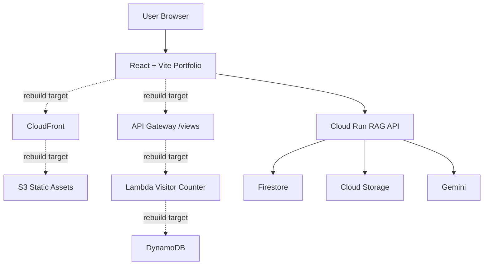
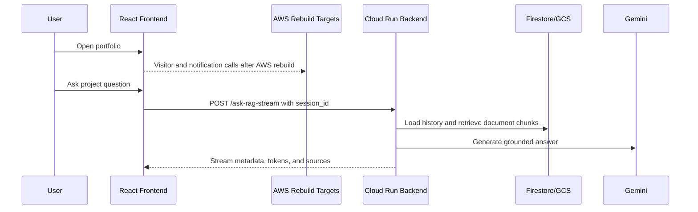

# Architecture

## Architecture Overview
Target architecture 會將 portfolio frontend 與 visitor/event workloads 放在 AWS，assistant questions 則送到 GCP Cloud Run backend 進行 retrieval 與 grounded answer generation。AWS side 曾經在原 AWS account 部署並可運作，但在新 AWS account 完成 rebuild 之前，不應描述為目前已部署。

:::aws
Previous state：S3、CloudFront、API Gateway、Lambda、DynamoDB 曾存在並可運作。
:::

:::gcp
RAG requests 由 Cloud Run、Firestore、Cloud Storage、Gemini 處理。
:::

```gallery
/project-images/AWS-Cloud-Project.png | AWS cloud project visual reference
```

## Main Components
| Layer | Service or Component |
| --- | --- |
| Frontend Layer | React |
| Frontend Layer | Vite |
| Frontend Layer | S3 |
| Frontend Layer | CloudFront |
| AWS Serverless Layer | API Gateway |
| AWS Serverless Layer | Lambda |
| AWS Serverless Layer | DynamoDB |
| GCP AI Backend Layer | Cloud Run |
| GCP AI Backend Layer | Firestore |
| GCP AI Backend Layer | Cloud Storage |
| GCP AI Backend Layer | Vertex AI Gemini |
| Planned AWS Events Layer | EventBridge |
| Planned AWS Events Layer | SNS |
| Planned AWS Events Layer | IAM roles and policies |

## System Flow


## System Module Design
| Step | Component | Role |
| --- | --- | --- |
| 1 | React + Vite | Browser application and project documentation UI |
| 2 | S3 + CloudFront | New AWS account static delivery rebuild target |
| 3 | API Gateway | Visitor counter API boundary to rebuild |
| 4 | Lambda | Visitor counter and event workflow compute to rebuild |
| 5 | DynamoDB | Visitor count and event state persistence to rebuild |
| 6 | Cloud Run | RAG API runtime |
| 7 | Firestore | Document chunks, conversations, and analytics |
| 8 | Gemini | Grounded answer generation |
| 9 | EventBridge + SNS | Planned event-driven notification workflow |

## Sequence Diagram


## Database Design
| Store | Current Status | Purpose |
| --- | --- | --- |
| Firestore document_chunks | Implemented | RAG chunks, embeddings, metadata |
| Firestore conversations | Implemented | Persistent assistant sessions |
| Firestore rag_analytics | Implemented | Metadata-only monitoring records |
| DynamoDB visitor table | Rebuild required | Visitor counter state |
| DynamoDB event table | Planned | Notification and milestone event state |

## Data Flow
```text
User
 ↓
React + Vite Portfolio
 ↓
Cloud Run
 ↓
Firestore + Gemini
```

## Technology Stack
| Area | Technologies |
| --- | --- |
| Frontend | React, Vite, JavaScript, CSS |
| AWS | S3, CloudFront, API Gateway, Lambda, DynamoDB |
| GCP | Cloud Run, Firestore, Cloud Storage, Vertex AI |
| AI/RAG | Gemini, text-embedding-005, source citations |
| Delivery | GitHub Actions, Docker, AWS CLI, gcloud |


## Architecture Notes

:::warning Status Boundary
AWS resources should be described as historical or rebuild-target components unless current deployment evidence exists in the new AWS account.
:::
