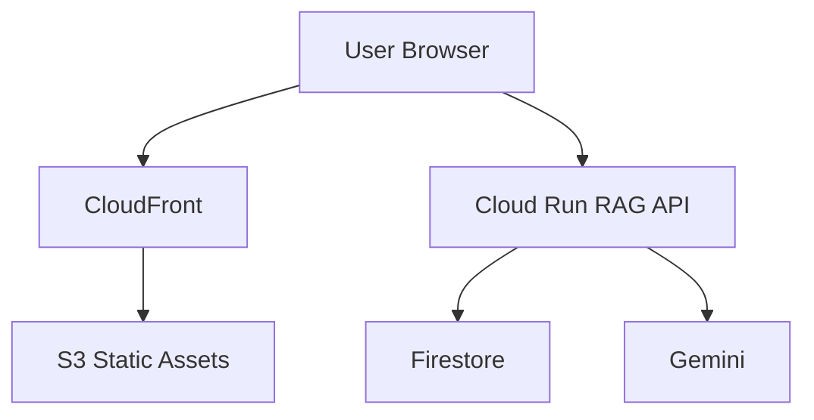

# 架構圖
前端以 AWS 靜態網站方式交付。Visitor metrics 保留在 AWS serverless path，assistant questions 則送到 GCP Cloud Run backend 進行 retrieval 與 grounded answer generation。

:::aws
Frontend assets hosted on S3，並透過 CloudFront delivery。
:::

:::gcp
RAG requests 由 Cloud Run、Firestore、Cloud Storage、Gemini 處理。
:::


# 系統模組
| Layer | Service or Component |
| --- | --- |
| Frontend Layer | React |
| Frontend Layer | Vite |
| Frontend Layer | S3 |
| Frontend Layer | CloudFront |
| AWS Serverless Layer | API Gateway |
| AWS Serverless Layer | Lambda |
| AWS Serverless Layer | DynamoDB |
| GCP AI Backend Layer | Cloud Run |
| GCP AI Backend Layer | Firestore |
| GCP AI Backend Layer | Cloud Storage |
| GCP AI Backend Layer | Vertex AI Gemini |

# 工作流程


| Step | Component | Role |
| --- | --- | --- |
| 1 | React + Vite | Browser application and project documentation UI |
| 2 | CloudFront | Static asset delivery |
| 3 | API Gateway | Visitor counter API boundary |
| 4 | Lambda | Visitor counter compute |
| 5 | DynamoDB | Visitor count persistence |
| 6 | Cloud Run | RAG API runtime |
| 7 | Firestore | Document chunks, conversations, and analytics |
| 8 | Gemini | Grounded answer generation |

## Reference Flow
```text
User
 ↓
CloudFront
 ↓
S3
 ↓
Cloud Run
 ↓
Firestore + Gemini
```

# 技術棧
| Area | Technologies |
| --- | --- |
| Frontend | React, Vite, JavaScript, CSS |
| AWS | S3, CloudFront, API Gateway, Lambda, DynamoDB |
| GCP | Cloud Run, Firestore, Cloud Storage, Vertex AI |
| AI/RAG | Gemini, text-embedding-005, source citations |
| Delivery | GitHub Actions, Docker, AWS CLI, gcloud |
