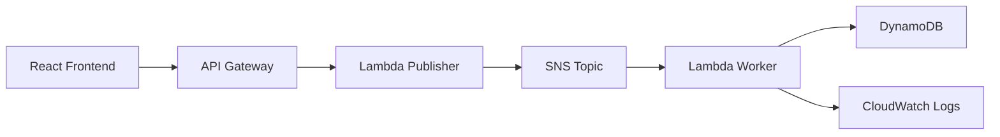

# Architecture

## Architecture Overview
Publishers send event announcements through an API boundary. SNS distributes the event to subscribers, Lambda handlers process messages, and DynamoDB stores event-related state.

## Main Components
| Layer | Service or Component |
| --- | --- |
| API Layer | API Gateway |
| Event Layer | SNS |
| Compute Layer | Lambda |
| Data Layer | DynamoDB |
| Operations Layer | CloudWatch |

## System Flow

| Step | Component | Role |
| --- | --- | --- |
| 1 | API Gateway | Receives event publish request |
| 2 | SNS | Fans out event notifications |
| 3 | Lambda | Processes subscriber workload |
| 4 | DynamoDB | Stores event metadata |
| 5 | CloudWatch | Captures logs and operational signals |

## Technology Stack
| Area | Technologies |
| --- | --- |
| Cloud | AWS |
| Messaging | SNS |
| Compute | Lambda |
| Database | DynamoDB |
| Operations | CloudWatch |

## Data Flow

1. Frontend publishes an event request.
2. API Gateway invokes Lambda.
3. Lambda validates the event and publishes to SNS.
4. Worker Lambda processes the event and writes state.
5. CloudWatch captures operational logs.

## Architecture Notes

No real image or gallery assets exist for this project yet. Do not add fake image references until diagrams or screenshots are created.
