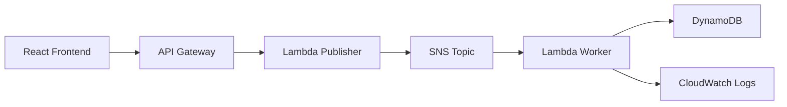

# Architecture

## Architecture Overview

Publishers 透過 API boundary 發送 event announcements。SNS 將 event 分送給 subscribers，Lambda handlers 處理 messages，DynamoDB 保存 event-related state。

## Main Components

| Layer            | Service or Component |
| ---------------- | -------------------- |
| API Layer        | API Gateway          |
| Event Layer      | SNS                  |
| Compute Layer    | Lambda               |
| Data Layer       | DynamoDB             |
| Operations Layer | CloudWatch           |

## System Flow

| Step | Component   | Role                         |
| ---- | ----------- | ---------------------------- |
| 1    | API Gateway | 接收 event publish request   |
| 2    | SNS         | Fan out announcement message |
| 3    | Lambda      | Validate and process message |
| 4    | DynamoDB    | Store event state            |
| 5    | CloudWatch  | Capture logs and metrics     |

## Technology Stack

- AWS API Gateway
- AWS Lambda
- Amazon SNS
- Amazon DynamoDB
- Amazon CloudWatch

## Data Flow

1. Frontend publishes an event request.
2. API Gateway invokes Lambda.
3. Lambda validates the event and publishes to SNS.
4. Worker Lambda processes the event and writes state.
5. CloudWatch captures operational logs.

## Architecture Notes

此專案目前沒有真實 image 或 gallery assets。不要加入假的 image references；等實際 diagram 或 screenshot 建立後再補上。
