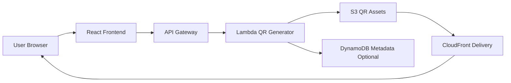

# Architecture

## Architecture Overview

Status: Planned / Documentation Placeholder

The planned QR Code Generator uses a React frontend for input and preview, API Gateway for requests, Lambda for QR generation, and S3 for optional generated image storage. CloudFront can deliver the frontend and stored assets.

## System Flow

## Main Components

| Layer | Component | Responsibility |
| --- | --- | --- |
| Frontend | React | Input form, preview, download action |
| API | API Gateway | Public QR generation route |
| Compute | Lambda | QR image generation and validation |
| Storage | S3 | Optional generated QR image storage |
| Metadata | DynamoDB | Optional QR metadata records |
| Delivery | CloudFront | Static frontend and asset delivery |

## Data Flow

1. A user enters a URL or text value.
2. The frontend submits the value to API Gateway.
3. Lambda validates the input and generates a QR image.
4. Lambda returns the generated image directly or stores it in S3.
5. The frontend displays the preview and download option.

## Technology Stack

- React
- Vite
- Amazon API Gateway
- AWS Lambda
- Amazon S3
- Amazon CloudFront
- Amazon DynamoDB optional
- CloudWatch Logs

## Architecture Notes

The simplest version can generate and return an image without persistence. A portfolio-grade version can store generated images in S3 and keep metadata in DynamoDB for history, expiration, or usage tracking.
