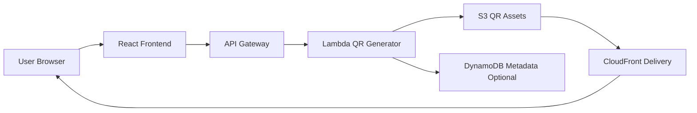

# Architecture

## Architecture Overview

Status: Planned / Documentation Placeholder

規劃中的 QR Code Generator 使用 React frontend 處理 input 與 preview，API Gateway 接收 requests，Lambda 產生 QR image，S3 optional 儲存 generated image。CloudFront 可交付 frontend 與 stored assets。

## System Flow

## Main Components

| Layer | Component | Responsibility |
| --- | --- | --- |
| Frontend | React | Input form、preview、download action |
| API | API Gateway | Public QR generation route |
| Compute | Lambda | QR image generation 與 validation |
| Storage | S3 | Optional generated QR image storage |
| Metadata | DynamoDB | Optional QR metadata records |
| Delivery | CloudFront | Static frontend 與 asset delivery |

## Data Flow

1. User 輸入 URL 或 text value。
2. Frontend 將 value 送至 API Gateway。
3. Lambda 驗證 input 並產生 QR image。
4. Lambda 直接回傳 generated image，或將 image 儲存在 S3。
5. Frontend 顯示 preview 與 download option。

## Technology Stack

- React
- Vite
- Amazon API Gateway
- AWS Lambda
- Amazon S3
- Amazon CloudFront
- Amazon DynamoDB optional
- CloudWatch Logs

## Architecture Notes

最簡版本可以直接產生並回傳 image，不需要 persistence。較完整的 portfolio version 可以把 generated images 存到 S3，並在 DynamoDB 保存 history、expiration 或 usage metadata。
