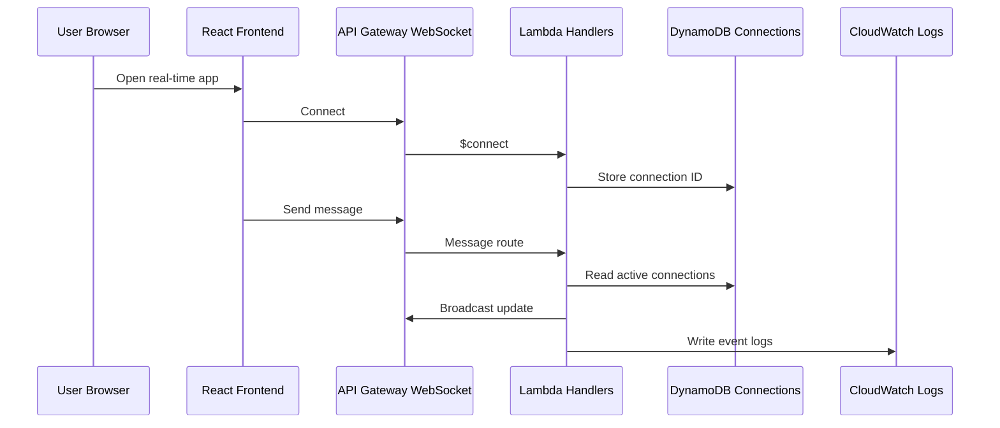

# 1

## 1

### 1

# 1

## Architecture Overview

Status: Planned / Documentation Placeholder

The planned architecture uses a React frontend connected to API Gateway WebSocket API. Lambda handlers process connection, disconnection, and message events. DynamoDB stores active connection IDs, and CloudWatch records operational logs.

## System Flow

## Main Components

| Layer         | Component                 | Responsibility                            |
| ------------- | ------------------------- | ----------------------------------------- |
| Frontend      | React                     | Connection UI and message/event display   |
| Realtime API  | API Gateway WebSocket API | Persistent client connections             |
| Compute       | Lambda                    | Connect, disconnect, and message handlers |
| State         | DynamoDB                  | Active connection records                 |
| Observability | CloudWatch                | Logs and operational signals              |

## Data Flow

1. The browser opens a WebSocket connection.
2. The `$connect` Lambda stores the connection ID.
3. A client sends a message or event.
4. Lambda reads active connections from DynamoDB.
5. Lambda broadcasts updates to connected clients.
6. The `$disconnect` handler removes stale connection records.

## Technology Stack

- React
- Vite
- Amazon API Gateway WebSocket API
- AWS Lambda
- Amazon DynamoDB
- Amazon CloudWatch

## Architecture Notes

The connection table is the key data structure. It should be designed for fast lookups and safe cleanup because stale connection IDs are normal in WebSocket applications.
