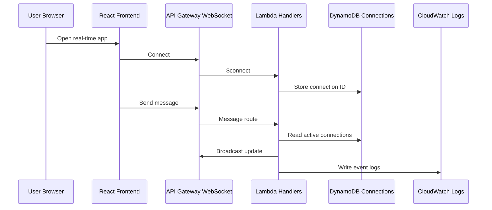

# Architecture

## Architecture Overview

Status: Planned / Documentation Placeholder

規劃架構使用 React frontend 連接 API Gateway WebSocket API。Lambda handlers 處理 connection、disconnection 與 message events。DynamoDB 保存 active connection IDs，CloudWatch 保存 operational logs。

## System Flow

## Main Components

| Layer | Component | Responsibility |
| --- | --- | --- |
| Frontend | React | Connection UI 與 message/event display |
| Realtime API | API Gateway WebSocket API | Persistent client connections |
| Compute | Lambda | Connect、disconnect 與 message handlers |
| State | DynamoDB | Active connection records |
| Observability | CloudWatch | Logs 與 operational signals |

## Data Flow

1. Browser 開啟 WebSocket connection。
2. `$connect` Lambda 保存 connection ID。
3. Client 發送 message 或 event。
4. Lambda 從 DynamoDB 讀取 active connections。
5. Lambda broadcast updates 給 connected clients。
6. `$disconnect` handler 移除 stale connection records。

## Technology Stack

- React
- Vite
- Amazon API Gateway WebSocket API
- AWS Lambda
- Amazon DynamoDB
- Amazon CloudWatch

## Architecture Notes

Connection table 是關鍵資料結構。它應支援快速查詢與安全 cleanup，因為 WebSocket applications 中 stale connection IDs 很常見。
