# Database

Amazon DynamoDB serves as the primary database for the Recipe Sharing App. It stores recipe records and provides a fully managed NoSQL data store that integrates directly with the FastAPI backend.

The database was selected because it offers a serverless architecture, automatic scaling, high availability, and seamless integration with AWS services.

---

## Database Overview

The application uses a single DynamoDB table to store recipe information.

### Database Responsibilities

- Store recipe records.
- Retrieve recipe data.
- Support recipe creation.
- Support recipe deletion.
- Provide durable and highly available storage.

---

## DynamoDB Configuration

| Setting          | Value                         |
| ---------------- | ----------------------------- |
| Database Service | Amazon DynamoDB               |
| Region           | ap-northeast-1                |
| Table Name       | Cloud-Project-Recipes-Sharing |
| Billing Mode     | On-Demand (Pay-per-request)   |
| Data Model       | Document-based NoSQL          |

### Why On-Demand Capacity?

The application uses DynamoDB On-Demand mode because:

- No capacity planning is required.
- Automatic scaling is provided by AWS.
- Suitable for unpredictable workloads.
- Simplifies operational management.

---

## Table Design

The Recipe Sharing App uses a simple table structure where each recipe is stored as a single item.

### Primary Key

| Attribute | Type   | Purpose                           |
| --------- | ------ | --------------------------------- |
| id        | String | Unique identifier for each recipe |

### Table Structure

```text
Cloud-Project-Recipes-Sharing
│
└── Partition Key
     └── id (String)
```

Each recipe is uniquely identified by its `id` value.

---

## Recipe Item Structure

Each DynamoDB item represents a complete recipe document.

### Example Record

```json
{
  "id": "recipe-001",
  "title": "Pizza",
  "ingredients": [
    {
      "id": 1,
      "description": "Cheese"
    },
    {
      "id": 2,
      "description": "Tomato Sauce"
    }
  ],
  "steps": [
    {
      "id": 1,
      "description": "Prepare ingredients"
    },
    {
      "id": 2,
      "description": "Bake for 20 minutes"
    }
  ]
}
```

### Attribute Description

| Attribute   | Description                  |
| ----------- | ---------------------------- |
| id          | Unique recipe identifier     |
| title       | Recipe name                  |
| ingredients | List of recipe ingredients   |
| steps       | List of cooking instructions |

---

## Data Access Pattern

The application uses a simple CRUD access pattern.

| User Action   | API Endpoint         | DynamoDB Operation |
| ------------- | -------------------- | ------------------ |
| View Recipes  | GET /recipes         | Scan               |
| Create Recipe | POST /recipes        | PutItem            |
| Delete Recipe | DELETE /recipes/{id} | DeleteItem         |

Because the application is small and educational in nature, a full table scan is sufficient for retrieving recipes.

---

## Database Workflow

The following workflow illustrates how data moves between the application and DynamoDB.

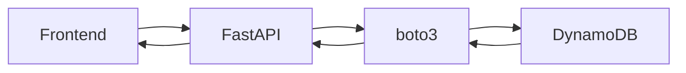

---

## Database Request Lifecycle

### Recipe Creation

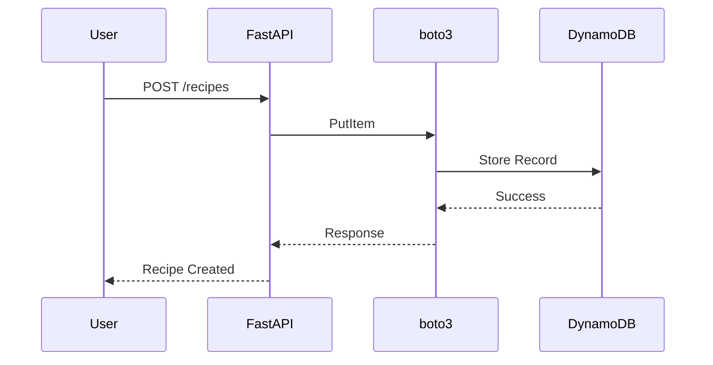

### Recipe Retrieval

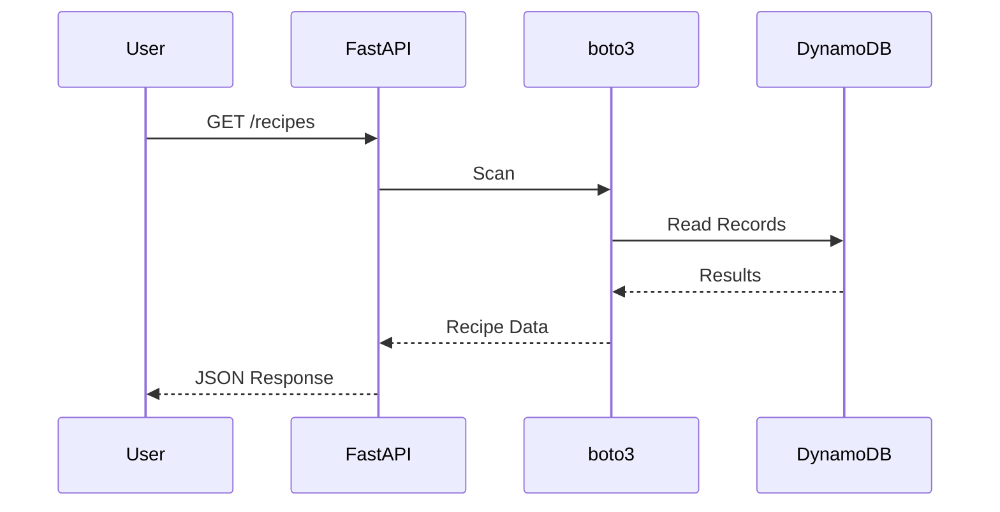

---

## Local Verification

Verify the DynamoDB table exists:

```bash
aws dynamodb list-tables \
--region ap-northeast-1
```

Expected output:

```text
Cloud-Project-Recipes-Sharing
```

Retrieve table details:

```bash
aws dynamodb describe-table \
--table-name Cloud-Project-Recipes-Sharing \
--region ap-northeast-1
```

---

## Testing Database Operations

### Create a Recipe

```bash
curl -X POST \
http://127.0.0.1:8000/recipes
```

Expected Result:

- New item stored in DynamoDB.
- Recipe appears in subsequent retrieval requests.

### Retrieve Recipes

```bash
curl http://127.0.0.1:8000/recipes
```

Expected Result:

- Stored recipe records are returned.

### Delete Recipe

```bash
curl -X DELETE \
http://127.0.0.1:8000/recipes/<recipe_id>
```

Expected Result:

- Recipe item removed from DynamoDB.

---

## Design Decisions

| Decision               | Reason                                             |
| ---------------------- | -------------------------------------------------- |
| DynamoDB               | Fully managed NoSQL database                       |
| On-Demand Capacity     | Automatic scaling with minimal administration      |
| Single Table Design    | Simple architecture suitable for the project scope |
| Document-Based Storage | Stores recipe data naturally as nested objects     |
| AWS Managed Service    | Eliminates database server management              |

The database layer was intentionally kept simple to focus on application development, API integration, and cloud-native service adoption while providing a scalable foundation for future enhancements.

# Network

The network layer provides the foundational AWS networking environment for the Recipe Sharing App. It was provisioned using CloudFormation and defines the VPC, public subnets, internet access, and exported network outputs used by later infrastructure stacks.

This stack creates the base network required for internet-facing resources such as the Application Load Balancer and EC2 instances.

---

## VPC

A custom Amazon Virtual Private Cloud (VPC) was created to isolate the application networking environment from the default AWS network.

| Setting       | Value            |
| ------------- | ---------------- |
| VPC Name      | `recipe-cfn-vpc` |
| CIDR Block    | `10.30.0.0/16`   |
| DNS Support   | Enabled          |
| DNS Hostnames | Enabled          |

### Purpose

The VPC provides:

- Network isolation for application resources.
- A controlled IP address range.
- DNS support for AWS resource communication.
- A reusable foundation for subnets, route tables, and compute resources.

---

## Public Subnets

Two public subnets were created across two Availability Zones to support high availability for internet-facing resources.

| Subnet          | CIDR Block     | Availability Zone   | Public IP on Launch | Name                         |
| --------------- | -------------- | ------------------- | ------------------- | ---------------------------- |
| Public Subnet 1 | `10.30.1.0/24` | First AZ in region  | Enabled             | `recipe-cfn-public-subnet-1` |
| Public Subnet 2 | `10.30.2.0/24` | Second AZ in region | Enabled             | `recipe-cfn-public-subnet-2` |

### Purpose

The public subnets are used for resources that need internet connectivity, such as:

- Application Load Balancer
- Public-facing EC2 instances during testing
- Resources that require direct inbound or outbound internet access

Using two subnets across separate Availability Zones improves availability and prepares the architecture for load balancing and Auto Scaling.

---

## Internet Gateway

An Internet Gateway was attached to the VPC to allow internet communication for resources placed in public subnets.

| Resource         | Name             |
| ---------------- | ---------------- |
| Internet Gateway | `recipe-cfn-igw` |

### Purpose

The Internet Gateway enables:

- Inbound internet traffic to public resources.
- Outbound internet access from public subnet resources.
- Public routing through the route table.

---

## Route Table

A public route table was created and associated with both public subnets.

| Route Table        | Name                   |
| ------------------ | ---------------------- |
| Public Route Table | `recipe-cfn-public-rt` |

### Public Route

| Destination | Target           |
| ----------- | ---------------- |
| `0.0.0.0/0` | Internet Gateway |

This route allows traffic from the public subnets to reach the internet.

---

## Route Table Associations

Both public subnets are associated with the public route table.

| Subnet          | Associated Route Table |
| --------------- | ---------------------- |
| Public Subnet 1 | Public Route Table     |
| Public Subnet 2 | Public Route Table     |

This makes both subnets public because they have:

1. A route to the Internet Gateway.
2. Public IP assignment enabled on launch.

---

## Network Architecture Diagram

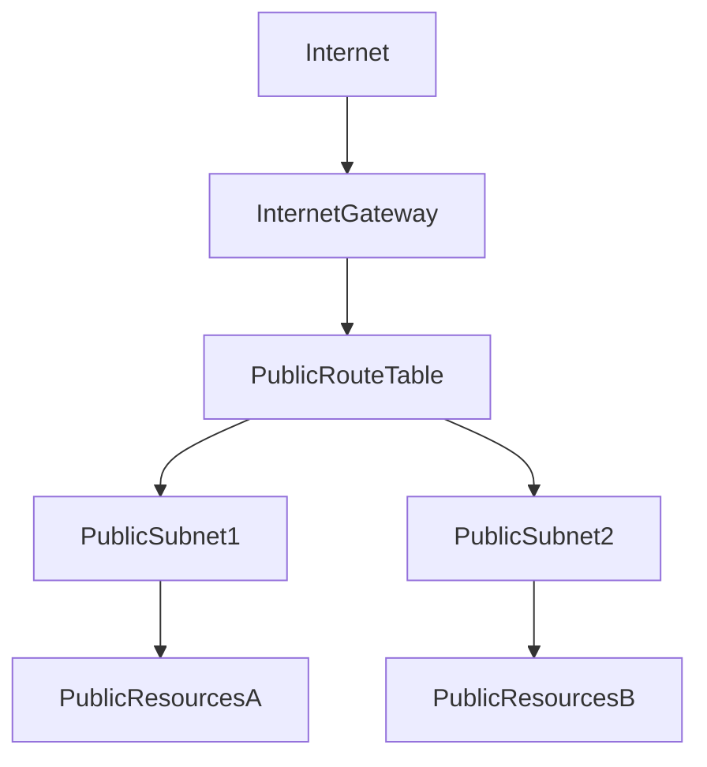

---

## Network Traffic Flow

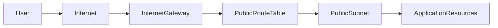

### Flow Explanation

1. User traffic enters from the internet.
2. The Internet Gateway provides connectivity into the VPC.
3. The public route table routes internet traffic to the correct public subnet.
4. Public subnet resources can receive and send internet traffic.
5. Later stacks deploy compute and load-balancing resources into these public subnets.

---

## CloudFormation Outputs

The network stack exports key resource IDs so that later CloudFormation stacks can reuse them.

| Output             | Export Name                     | Purpose                                   |
| ------------------ | ------------------------------- | ----------------------------------------- |
| VPC ID             | `recipe-cfn-vpc-id`             | Used by security, compute, and ALB stacks |
| Public Subnet 1 ID | `recipe-cfn-public-subnet-1-id` | Used for ALB and compute placement        |
| Public Subnet 2 ID | `recipe-cfn-public-subnet-2-id` | Used for ALB and compute placement        |

### Why Outputs Matter

CloudFormation exports allow the infrastructure to be separated into multiple modular stacks. Instead of hardcoding VPC and subnet IDs, later stacks import these values.

This improves:

- Maintainability
- Reusability
- Deployment consistency
- Separation of infrastructure layers

---

## Design Decisions

| Decision            | Reason                                                        |
| ------------------- | ------------------------------------------------------------- |
| Custom VPC          | Provides isolation from the default VPC                       |
| `/16` CIDR block    | Allows future subnet expansion                                |
| Two public subnets  | Supports multi-AZ architecture                                |
| Public IP on launch | Allows public resources to receive public IP addresses        |
| Internet Gateway    | Enables internet connectivity                                 |
| Exported outputs    | Allows other CloudFormation stacks to reuse network resources |

---

## Current Limitation

This network stack currently creates public subnets only. Private subnets and NAT Gateway are not included in this version.

### Future Enhancement

A more production-oriented version could add:

- Private subnets for backend EC2 instances.
- NAT Gateway for controlled outbound internet access.
- Separate route tables for private workloads.
- Backend instances reachable only through the Application Load Balancer.

This would improve the security posture by keeping application servers away from direct public internet exposure.

## Compute

The compute layer runs the FastAPI backend application on Amazon EC2. This layer was provisioned using CloudFormation and includes a Launch Template and an Auto Scaling Group.

The compute stack is responsible for defining how backend instances are created, configured, started, and replaced if unhealthy.

---

## Compute Architecture Overview

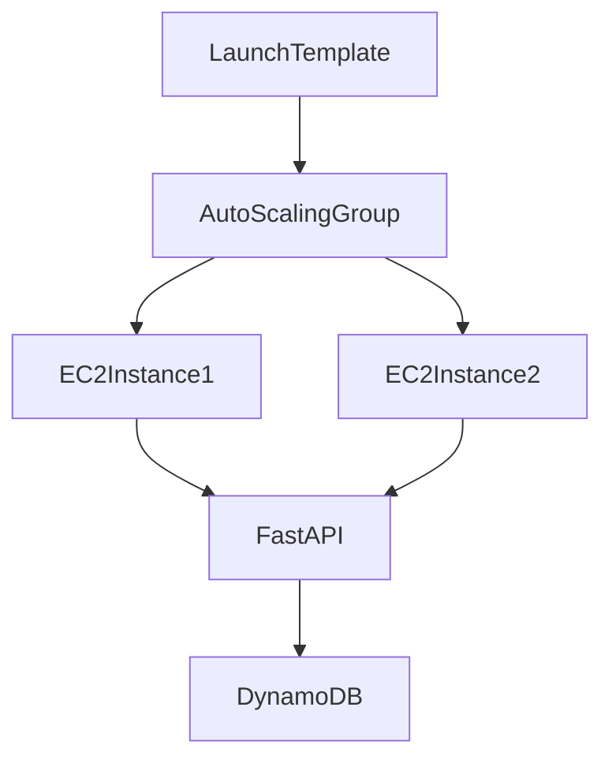

---

## Amazon EC2

Amazon EC2 provides the virtual server environment used to run the FastAPI backend.

| Setting              | Value                                            |
| -------------------- | ------------------------------------------------ |
| AMI ID               | `ami-0c02cf818fceb9254`                          |
| Instance Type        | `t3.micro`                                       |
| Public IP            | Enabled                                          |
| Security Group       | Imported from `recipe-cfn-ec2-sg-id`             |
| IAM Instance Profile | Imported from `recipe-cfn-instance-profile-name` |
| Application Port     | `8000`                                           |
| Runtime              | Python 3                                         |
| Backend Framework    | FastAPI                                          |
| Application Server   | Uvicorn                                          |

---

## Launch Template

A Launch Template was created to standardize how EC2 backend instances are provisioned.

| Setting              | Value                              |
| -------------------- | ---------------------------------- |
| Launch Template Name | `recipe-cfn-lt`                    |
| Instance Type        | `t3.micro`                         |
| AMI                  | `ami-0c02cf818fceb9254`            |
| IAM Instance Profile | `recipe-cfn-instance-profile-name` |
| Security Group       | `recipe-cfn-ec2-sg-id`             |
| User Data            | Backend bootstrap script           |

### Purpose

The Launch Template acts as a reusable blueprint for EC2 instances. It defines the configuration required to launch a backend server consistently.

This includes:

- Operating system image.
- Instance type.
- IAM permissions.
- Network interface configuration.
- Security group attachment.
- Application bootstrap process.

---

## EC2 Bootstrap Process

Each EC2 instance is automatically configured through the User Data script in the Launch Template.

### Bootstrap Responsibilities

| Step | Action                                   |
| ---- | ---------------------------------------- |
| 1    | Update system packages                   |
| 2    | Install Git, Python 3, and pip           |
| 3    | Clone the application repository         |
| 4    | Navigate to the backend source directory |
| 5    | Create a Python virtual environment      |
| 6    | Install backend dependencies             |
| 7    | Create a `systemd` service for FastAPI   |
| 8    | Enable and start the backend service     |

---

## Bootstrap Workflow

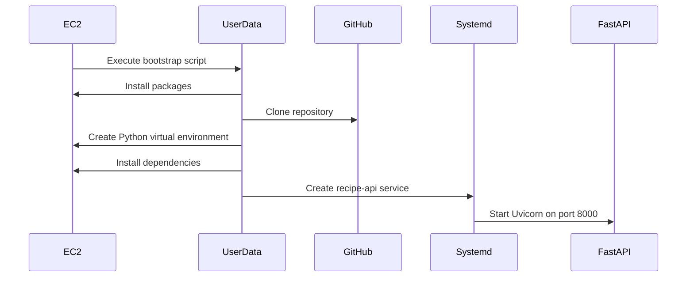

---

## FastAPI Systemd Service

The backend application is managed as a Linux `systemd` service.

| Setting              | Value                           |
| -------------------- | ------------------------------- |
| Service Name         | `recipe-api.service`            |
| User                 | `ec2-user`                      |
| Working Directory    | Backend project directory       |
| Environment Variable | `TABLE_NAME=recipe-cfn-recipes` |
| ExecStart            | Uvicorn server command          |
| Restart Policy       | `always`                        |

### Purpose

Using `systemd` ensures that the backend service:

- Starts automatically after instance boot.
- Keeps running in the background.
- Restarts if the application process fails.
- Can be managed using standard Linux service commands.

### Useful Commands

```bash
sudo systemctl status recipe-api
```

```bash
sudo systemctl restart recipe-api
```

```bash
sudo journalctl -u recipe-api -f
```

---

## Auto Scaling Group

The Auto Scaling Group manages backend EC2 instances using the Launch Template.

| Setting                   | Value                                       |
| ------------------------- | ------------------------------------------- |
| Auto Scaling Group Name   | `recipe-cfn-asg`                            |
| Minimum Capacity          | `1`                                         |
| Desired Capacity          | `1`                                         |
| Maximum Capacity          | `2`                                         |
| Subnets                   | Public Subnet 1 and Public Subnet 2         |
| Target Group              | Imported from `recipe-cfn-target-group-arn` |
| Health Check Type         | `EC2`                                       |
| Health Check Grace Period | `300` seconds                               |

---

## Auto Scaling Responsibilities

The Auto Scaling Group is responsible for:

- Maintaining the desired number of backend instances.
- Launching EC2 instances from the Launch Template.
- Placing instances across available public subnets.
- Registering instances with the ALB Target Group.
- Replacing unhealthy EC2 instances.

---

## Auto Scaling Recovery Flow

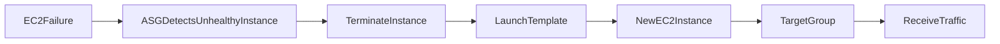

### Flow Explanation

1. An EC2 instance becomes unhealthy or stops running.
2. The Auto Scaling Group detects that capacity has dropped below the desired value.
3. The unhealthy instance is terminated.
4. A new instance is launched using the Launch Template.
5. The new instance runs the User Data bootstrap script.
6. The FastAPI backend starts automatically.
7. The instance is registered with the target group and becomes available for traffic.

---

## Compute-to-Load-Balancer Integration

The Auto Scaling Group is attached to the Application Load Balancer Target Group through the imported target group ARN.

```text
recipe-cfn-target-group-arn
```

This allows backend instances launched by the Auto Scaling Group to automatically become load balancer targets.

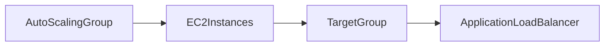

---

## CloudFormation Outputs

The compute stack exports values that can be referenced by other stacks or used for verification.

| Output                  | Export Name                     | Purpose                            |
| ----------------------- | ------------------------------- | ---------------------------------- |
| Launch Template ID      | `recipe-cfn-launch-template-id` | Identifies the EC2 Launch Template |
| Auto Scaling Group Name | `recipe-cfn-asg-name`           | Identifies the Auto Scaling Group  |

---

## Design Decisions

| Decision                | Reason                                                          |
| ----------------------- | --------------------------------------------------------------- |
| Launch Template         | Standardizes EC2 instance creation                              |
| Auto Scaling Group      | Provides self-healing infrastructure                            |
| `t3.micro`              | Cost-effective instance type for project scale                  |
| User Data bootstrap     | Automates backend setup on instance launch                      |
| `systemd` service       | Keeps FastAPI running as a managed service                      |
| Public IP enabled       | Allows instances to access the internet without NAT Gateway     |
| IAM Instance Profile    | Allows backend to access DynamoDB without hardcoded credentials |
| Target Group attachment | Enables ALB routing to Auto Scaling instances                   |

---

## Current Limitation

The EC2 instances are currently launched in public subnets with public IP addresses.

This is acceptable for a learning project and simplifies deployment, but it is not the preferred production design for backend services.

### Future Enhancement

A more production-ready architecture would place EC2 backend instances in private subnets and expose them only through the Application Load Balancer.

That design would require:

- Private subnets.
- NAT Gateway or VPC endpoints for outbound package installation and AWS service access.
- ALB deployed in public subnets.
- EC2 instances deployed in private subnets.
- Security group rules allowing traffic only from ALB to EC2.

## Traffic Management

## Application Load Balancer

The Application Load Balancer is the backend traffic entry point for the Recipe Sharing App. It receives HTTP requests and forwards them to FastAPI backend instances running on EC2.

This layer was provisioned using CloudFormation and includes:

- An Application Load Balancer
- A Target Group
- An HTTP Listener
- Health check configuration
- CloudFormation outputs for later stack integration

---

## ALB Configuration

| Setting            | Value                                |
| ------------------ | ------------------------------------ |
| Load Balancer Name | `recipe-cfn-alb`                     |
| Type               | Application Load Balancer            |
| Scheme             | Internet-facing                      |
| Protocol           | HTTP                                 |
| Listener Port      | `80`                                 |
| Security Group     | Imported from `recipe-cfn-alb-sg-id` |
| Subnets            | Public Subnet 1 and Public Subnet 2  |

---

## Target Group

The Target Group defines where the ALB forwards backend requests.

| Setting           | Value                             |
| ----------------- | --------------------------------- |
| Target Group Name | `recipe-cfn-tg`                   |
| Target Type       | Instance                          |
| Protocol          | HTTP                              |
| Target Port       | `8000`                            |
| VPC               | Imported from `recipe-cfn-vpc-id` |

### Purpose

The Target Group connects the ALB to backend EC2 instances. Since the FastAPI application runs on port `8000`, the ALB forwards requests to the Target Group on that port.

---

## Health Check Configuration

The Target Group uses the backend `/health` endpoint to determine whether an EC2 instance is healthy.

| Setting               | Value        |
| --------------------- | ------------ |
| Health Check Protocol | HTTP         |
| Health Check Path     | `/health`    |
| Health Check Port     | Traffic port |
| Expected HTTP Code    | `200`        |

### Purpose

The health check prevents traffic from being sent to unhealthy backend instances.

If an instance fails the health check, the ALB stops routing traffic to it until it becomes healthy again.

---

## Listener Configuration

The ALB Listener accepts inbound HTTP traffic on port `80`.

| Setting           | Value                      |
| ----------------- | -------------------------- |
| Listener Port     | `80`                       |
| Listener Protocol | HTTP                       |
| Default Action    | Forward to `recipe-cfn-tg` |

### Listener Flow

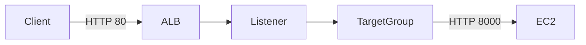

---

## Request Routing Flow

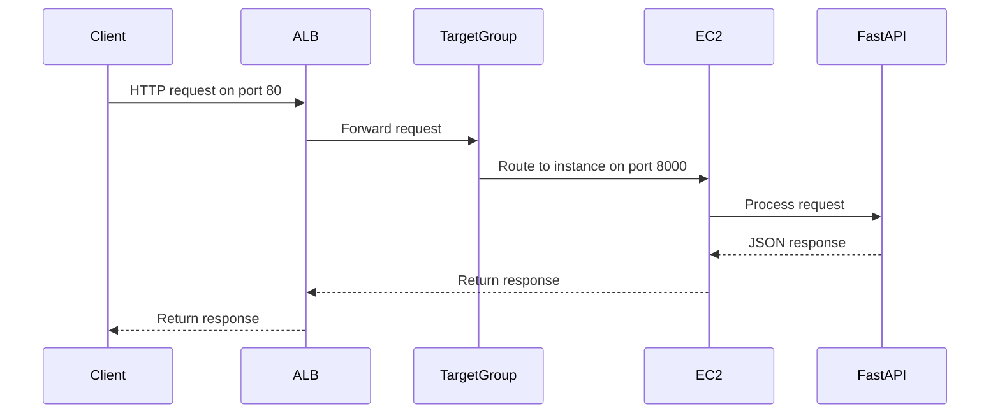

---

## ALB and Auto Scaling Integration

The Target Group ARN is exported by the ALB stack and imported by the Compute stack.

```text
recipe-cfn-target-group-arn
```

The Auto Scaling Group uses this Target Group ARN so that newly launched EC2 instances are automatically registered as backend targets.

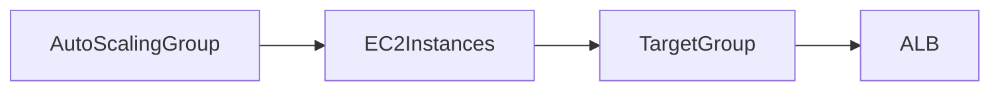

### Integration Benefits

| Feature                   | Benefit                                              |
| ------------------------- | ---------------------------------------------------- |
| Target Group registration | New EC2 instances can receive traffic automatically  |
| Health checks             | Unhealthy instances are removed from routing         |
| Multi-subnet ALB          | Supports high availability across Availability Zones |
| ASG integration           | Supports self-healing backend infrastructure         |

---

## CloudFormation Outputs

The ALB stack exports values used by other layers.

| Output           | Export Name                   | Purpose                                                  |
| ---------------- | ----------------------------- | -------------------------------------------------------- |
| Target Group ARN | `recipe-cfn-target-group-arn` | Imported by the Auto Scaling Group                       |
| ALB DNS Name     | `recipe-cfn-alb-dns`          | Used to access the backend or configure upstream routing |

---

## Design Decisions

| Decision                  | Reason                                                     |
| ------------------------- | ---------------------------------------------------------- |
| Application Load Balancer | Supports HTTP routing for web applications                 |
| Internet-facing scheme    | Allows external users to reach backend traffic entry point |
| Public subnets            | Required for internet-facing ALB                           |
| Target type instance      | Routes traffic directly to EC2 instances                   |
| Target port 8000          | Matches FastAPI Uvicorn application port                   |
| `/health` endpoint        | Provides reliable health check path                        |
| Listener on port 80       | Simplifies HTTP-based project deployment                   |
| Exported Target Group ARN | Allows Compute stack to attach ASG instances               |

---

## Current Limitation

The ALB currently uses HTTP on port `80`.

This is acceptable for project testing, but production traffic should use HTTPS.

# Security

The security layer controls how traffic reaches the Recipe Sharing App backend and how EC2 instances access AWS services. This layer was provisioned through CloudFormation and includes Security Groups, an IAM Role, and an IAM Instance Profile.

The security design separates network-level access control from identity-based AWS permissions.

---

## Security Architecture Overview

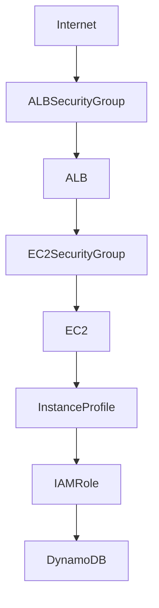

---

## Security Components

| Component          | Purpose                                                     |
| ------------------ | ----------------------------------------------------------- |
| ALB Security Group | Allows public HTTP traffic to the Application Load Balancer |
| EC2 Security Group | Allows backend traffic only from the ALB security group     |
| IAM Role           | Grants EC2 permission to access DynamoDB                    |
| Instance Profile   | Attaches the IAM role to EC2 instances                      |

---

## Security Groups

Security Groups act as virtual firewalls for AWS resources. They define which inbound traffic is allowed to reach the Application Load Balancer and backend EC2 instances.

---

## ALB Security Group

The Application Load Balancer security group allows inbound HTTP traffic from the internet.

| Setting             | Value                             |
| ------------------- | --------------------------------- |
| Security Group Name | `recipe-cfn-alb-sg`               |
| Attached Resource   | Application Load Balancer         |
| VPC                 | Imported from `recipe-cfn-vpc-id` |

### Inbound Rule

| Protocol | Port | Source      | Purpose                                    |
| -------- | ---- | ----------- | ------------------------------------------ |
| TCP      | 80   | `0.0.0.0/0` | Allow public HTTP traffic to reach the ALB |

### Purpose

The ALB is the internet-facing entry point for backend API traffic. Public users do not connect directly to EC2. Instead, requests are first accepted by the ALB.

---

## EC2 Security Group

The EC2 security group allows inbound traffic only from the ALB security group on FastAPI's application port.

| Setting             | Value                             |
| ------------------- | --------------------------------- |
| Security Group Name | `recipe-cfn-ec2-sg`               |
| Attached Resource   | EC2 backend instances             |
| VPC                 | Imported from `recipe-cfn-vpc-id` |

### Inbound Rule

| Protocol | Port | Source             | Purpose                                  |
| -------- | ---- | ------------------ | ---------------------------------------- |
| TCP      | 8000 | ALB Security Group | Allow ALB to forward requests to FastAPI |

### Purpose

This rule prevents direct public access to backend EC2 instances. Only traffic coming from the Application Load Balancer can reach the FastAPI service.

---

## Network Access Flow

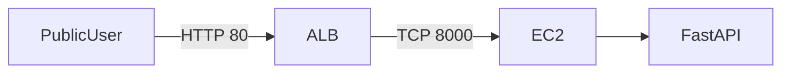

### Flow Explanation

1. Users send HTTP requests to the Application Load Balancer.
2. The ALB accepts traffic on port `80`.
3. The ALB forwards traffic to EC2 instances on port `8000`.
4. EC2 instances run the FastAPI backend.
5. Direct access from the internet to EC2 port `8000` is blocked because the source must be the ALB security group.

---

## IAM Role

An IAM Role was created to allow EC2 instances to access DynamoDB without storing AWS credentials inside the application code.

| Setting           | Value                          |
| ----------------- | ------------------------------ |
| Role Name         | `recipe-cfn-ec2-dynamodb-role` |
| Trusted Service   | EC2                            |
| Permission Policy | `AmazonDynamoDBFullAccess`     |

### Trust Relationship

The role trusts the EC2 service:

```text
ec2.amazonaws.com
```

This allows EC2 instances to assume the role automatically.

---

## IAM Instance Profile

An IAM Instance Profile was created to attach the IAM role to EC2 instances.

| Setting               | Value                          |
| --------------------- | ------------------------------ |
| Instance Profile Name | `recipe-cfn-instance-profile`  |
| Attached Role         | `recipe-cfn-ec2-dynamodb-role` |

### Purpose

EC2 instances cannot directly attach an IAM role by itself. They use an Instance Profile, which acts as the container that makes the IAM role available to the instance.

---

## IAM Permission Flow

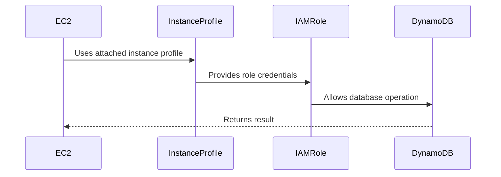

### Flow Explanation

1. The EC2 instance starts with the assigned Instance Profile.
2. The Instance Profile provides access to the IAM Role.
3. The application uses `boto3` without hardcoded credentials.
4. AWS automatically provides temporary credentials to the EC2 instance.
5. The FastAPI backend can call DynamoDB operations.

---

## CloudFormation Outputs

The security stack exports values for later infrastructure stacks.

| Output                | Export Name                        | Purpose                         |
| --------------------- | ---------------------------------- | ------------------------------- |
| ALB Security Group ID | `recipe-cfn-alb-sg-id`             | Used by the ALB stack           |
| EC2 Security Group ID | `recipe-cfn-ec2-sg-id`             | Used by the compute stack       |
| Instance Profile Name | `recipe-cfn-instance-profile-name` | Used by the EC2 Launch Template |

---

## Security Design Decisions

| Decision                             | Reason                                                           |
| ------------------------------------ | ---------------------------------------------------------------- |
| Separate ALB and EC2 security groups | Improves traffic control and separation of concerns              |
| ALB accepts internet traffic         | ALB acts as the controlled public entry point                    |
| EC2 only accepts traffic from ALB SG | Prevents direct public access to backend instances               |
| EC2 uses IAM Role                    | Avoids storing AWS credentials in code                           |
| Instance Profile used                | Required mechanism for attaching IAM role to EC2                 |
| Security outputs exported            | Allows modular CloudFormation stacks to reuse security resources |

---

## Current Limitation

The IAM role currently uses the AWS-managed policy:

```text
AmazonDynamoDBFullAccess
```

This works for project development, but it is broader than necessary.

## CloudFront

Amazon CloudFront serves as the global entry point for the Recipe Sharing App. It delivers the React frontend from S3 and routes API requests to the Application Load Balancer.

This layer was provisioned using CloudFormation and includes:

- CloudFront Distribution
- Origin Access Control
- S3 frontend origin
- ALB API origin
- Cache behaviors
- S3 bucket policy for private frontend access

---

## CloudFront Architecture Overview

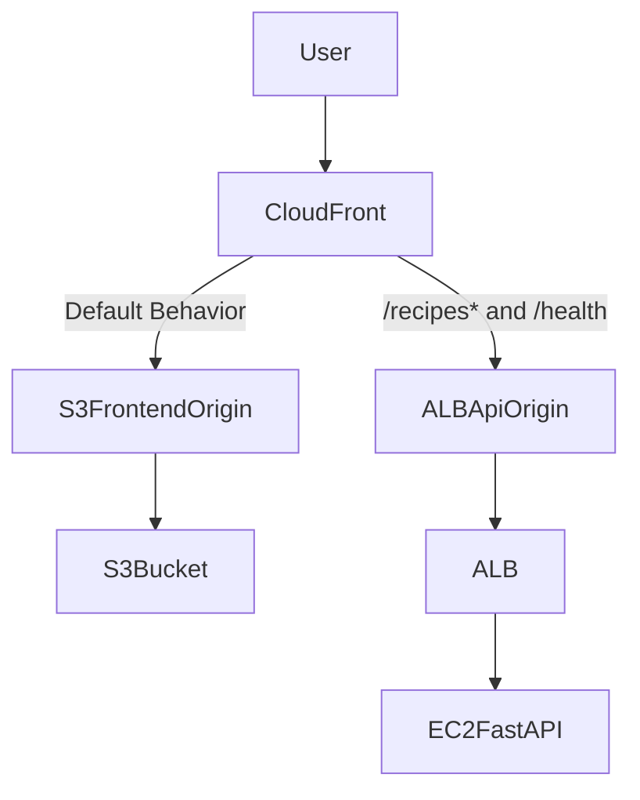

---

## Origin Access Control

CloudFront uses Origin Access Control to securely access the private S3 frontend bucket.

| Setting          | Value            |
| ---------------- | ---------------- |
| OAC Name         | `recipe-cfn-oac` |
| Origin Type      | S3               |
| Signing Behavior | Always           |
| Signing Protocol | SigV4            |

### Purpose

Origin Access Control prevents users from directly accessing the S3 bucket. Instead, users access frontend assets through CloudFront, and CloudFront signs requests to S3 using SigV4.

---

## CloudFront Origins

The distribution uses two origins: one for static frontend files and one for backend API traffic.

| Origin ID          | Origin Type               | Purpose                                |
| ------------------ | ------------------------- | -------------------------------------- |
| `S3FrontendOrigin` | S3                        | Serves React production build files    |
| `ALBApiOrigin`     | Application Load Balancer | Routes API requests to FastAPI backend |

---

## S3 Frontend Origin

The S3 origin serves the static React build output.

| Setting             | Value                                           |
| ------------------- | ----------------------------------------------- |
| Origin ID           | `S3FrontendOrigin`                              |
| Bucket Name         | Imported from `recipe-cfn-frontend-bucket-name` |
| Access Method       | CloudFront Origin Access Control                |
| Default Root Object | `index.html`                                    |

### Purpose

This origin serves static frontend assets such as:

- `index.html`
- JavaScript bundles
- CSS files
- Images
- Other build artifacts

---

## ALB API Origin

The ALB origin forwards API requests to the FastAPI backend.

| Setting                | Value                              |
| ---------------------- | ---------------------------------- |
| Origin ID              | `ALBApiOrigin`                     |
| Domain Name            | Imported from `recipe-cfn-alb-dns` |
| Origin Protocol Policy | `http-only`                        |
| HTTP Port              | `80`                               |

### Purpose

This origin allows CloudFront to route backend API requests to the Application Load Balancer, which then forwards requests to FastAPI instances.

---

## Default Cache Behavior

The default cache behavior sends normal frontend requests to the S3 frontend origin.

| Setting                | Value                  |
| ---------------------- | ---------------------- |
| Target Origin          | `S3FrontendOrigin`     |
| Viewer Protocol Policy | Redirect HTTP to HTTPS |
| Allowed Methods        | `GET`, `HEAD`          |
| Cached Methods         | `GET`, `HEAD`          |
| Default Root Object    | `index.html`           |

### Purpose

The default behavior is optimized for static frontend hosting. Browser requests for the application UI are served from S3 through CloudFront.

---

## API Cache Behaviors

CloudFront uses separate cache behaviors for backend API routes.

### `/recipes*` Behavior

| Setting                | Value                                                      |
| ---------------------- | ---------------------------------------------------------- |
| Path Pattern           | `/recipes*`                                                |
| Target Origin          | `ALBApiOrigin`                                             |
| Viewer Protocol Policy | Redirect HTTP to HTTPS                                     |
| Allowed Methods        | `GET`, `HEAD`, `OPTIONS`, `PUT`, `POST`, `PATCH`, `DELETE` |
| Cached Methods         | `GET`, `HEAD`                                              |

### `/health` Behavior

| Setting                | Value                    |
| ---------------------- | ------------------------ |
| Path Pattern           | `/health`                |
| Target Origin          | `ALBApiOrigin`           |
| Viewer Protocol Policy | Redirect HTTP to HTTPS   |
| Allowed Methods        | `GET`, `HEAD`, `OPTIONS` |
| Cached Methods         | `GET`, `HEAD`            |

### Purpose

These behaviors allow CloudFront to distinguish between frontend traffic and API traffic.

- Frontend routes go to S3.
- Recipe API requests go to the ALB.
- Health check requests go to the ALB.
- Write operations such as `POST` and `DELETE` are allowed for API routes.

---

## Request Routing Flow

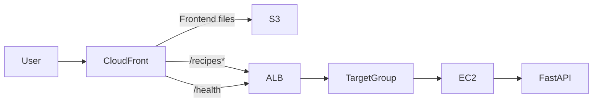

---

## Full Request Lifecycle

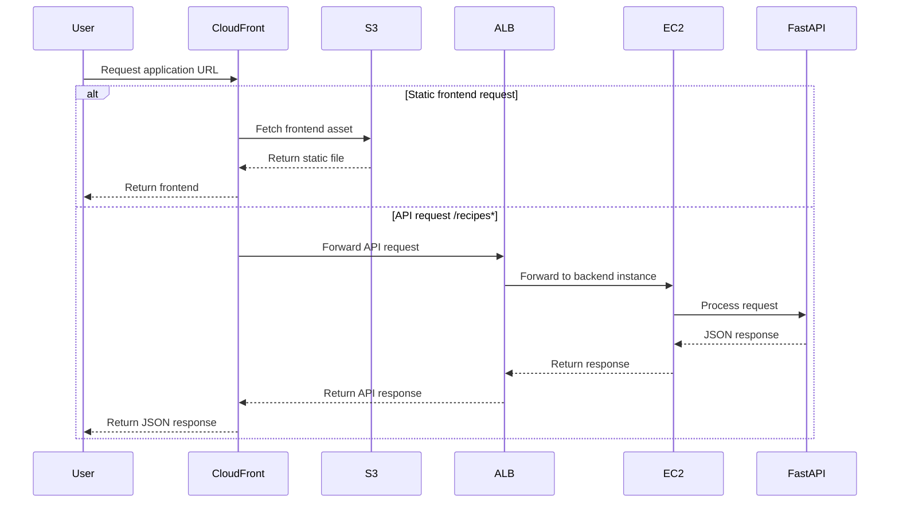

---

## S3 Bucket Policy

The CloudFront stack also creates an S3 bucket policy that allows CloudFront to read frontend files from the private S3 bucket.

| Policy Element | Value                       |
| -------------- | --------------------------- |
| Principal      | `cloudfront.amazonaws.com`  |
| Action         | `s3:GetObject`              |
| Resource       | Frontend bucket objects     |
| Condition      | CloudFront distribution ARN |

### Purpose

This policy ensures that only the CloudFront distribution can read objects from the frontend S3 bucket.

Users cannot bypass CloudFront and access the S3 bucket directly.

---

## CloudFormation Outputs

The CloudFront stack exports the distribution domain and URL.

| Output                 | Export Name                    | Purpose                |
| ---------------------- | ------------------------------ | ---------------------- |
| CloudFront Domain Name | `recipe-cfn-cloudfront-domain` | Distribution domain    |
| CloudFront URL         | `recipe-cfn-cloudfront-url`    | Public application URL |

---

## Design Decisions

| Decision                                 | Reason                                                         |
| ---------------------------------------- | -------------------------------------------------------------- |
| CloudFront as single entry point         | Provides one public URL for frontend and API traffic           |
| S3 origin for frontend                   | Static React build can be served efficiently                   |
| ALB origin for API                       | Allows backend API traffic to reach FastAPI                    |
| OAC for S3                               | Keeps the S3 bucket private                                    |
| HTTPS redirect                           | Forces viewer requests to use HTTPS                            |
| Separate cache behaviors                 | Routes frontend and API requests to different origins          |
| Full API methods allowed for `/recipes*` | Supports create, retrieve, update-style, and delete operations |
| Bucket policy restricted to CloudFront   | Prevents direct public S3 access                               |

---

## Current Limitation

CloudFront connects to the ALB origin using HTTP only.

```text
OriginProtocolPolicy: http-only
```

This is acceptable for a learning project, but production systems should encrypt traffic between CloudFront and the origin.

### Future Enhancement

A production-ready version should include:

- HTTPS between CloudFront and ALB.
- ACM certificate for the ALB.
- Custom domain name.
- AWS WAF integration.
- More explicit cache policy tuning for API routes.

# Deployment

This section describes how the Recipe Sharing App is deployed, managed, and provisioned within AWS. The deployment process evolved from local development to a fully automated CloudFormation-based infrastructure.

The final architecture combines React, FastAPI, DynamoDB, CloudFront, Application Load Balancer, Auto Scaling, and CloudFormation to deliver a scalable and repeatable deployment model.

## Deployment Workflow

The project followed a progressive deployment approach, beginning with local development and gradually introducing cloud-native infrastructure components.

## Deployment Stages

| Stage                        | Purpose                                        |
| ---------------------------- | ---------------------------------------------- |
| Local Development            | Build and test application functionality       |
| Manual AWS Deployment        | Learn and configure AWS services individually  |
| High Availability Deployment | Introduce load balancing and instance recovery |
| CloudFormation Deployment    | Automate infrastructure provisioning           |

---

## Deployment Workflow Overview

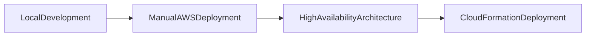

---

## Stage 1: Local Development Environment

The project initially ran entirely on a local development machine.

### Components

```text
Frontend
├── React
├── Vite
└── Material UI

Backend
├── FastAPI
├── Uvicorn
└── boto3

Database
└── DynamoDB
```

### Objectives

- Develop application features.
- Validate API functionality.
- Test frontend-backend communication.
- Verify DynamoDB integration.

---

## Stage 2: Manual AWS Deployment

After local validation, AWS resources were created manually to understand how individual services interact.

### Components Introduced

```text
AWS
├── VPC
├── Public Subnets
├── Security Groups
├── DynamoDB
└── EC2
```

### Objectives

- Learn core AWS networking concepts.
- Configure infrastructure manually.
- Deploy FastAPI on EC2.
- Connect backend services to DynamoDB.

---

## Stage 3: High Availability Architecture

The architecture was enhanced to improve availability and fault tolerance.

### Components Introduced

```text
CloudFront
    ↓
Application Load Balancer
    ↓
Auto Scaling Group
    ↓
EC2 Instances
```

### Objectives

- Distribute traffic across backend instances.
- Introduce health checks.
- Enable automatic instance recovery.
- Support multi-subnet deployment.

### Benefits

| Feature            | Benefit                        |
| ------------------ | ------------------------------ |
| ALB                | Traffic distribution           |
| Target Group       | Health monitoring              |
| Auto Scaling Group | Automatic instance replacement |
| Multiple Subnets   | Improved availability          |

---

## Stage 4: CloudFormation Deployment

Infrastructure provisioning was automated using CloudFormation.

### Components Managed by CloudFormation

```text
Network
Security
Data
Compute
ALB
CloudFront
```

### Objectives

- Eliminate repetitive manual configuration.
- Standardize infrastructure deployment.
- Improve consistency across environments.
- Simplify infrastructure maintenance.

---

# IaC

CloudFormation was used to provision and manage all AWS infrastructure resources.

The infrastructure was divided into multiple stacks to improve modularity, maintainability, and deployment consistency.

---

## CloudFormation Stack Architecture

```text
01-network.yaml
02-security.yaml
03-data.yaml
04-compute.yaml
05-alb.yaml
06-cloudfront.yaml
```

### Stack Responsibilities

| Stack         | Purpose                                           |
| ------------- | ------------------------------------------------- |
| 01-Network    | VPC, subnets, route tables, Internet Gateway      |
| 02-Security   | Security Groups, IAM Role, Instance Profile       |
| 03-Data       | DynamoDB resources                                |
| 04-Compute    | Launch Template and Auto Scaling Group            |
| 05-ALB        | Application Load Balancer, Listener, Target Group |
| 06-CloudFront | CloudFront Distribution and Origin Access Control |

---

## CloudFormation Deployment Order

Because later stacks depend on resources created by earlier stacks, deployments must follow a specific order.

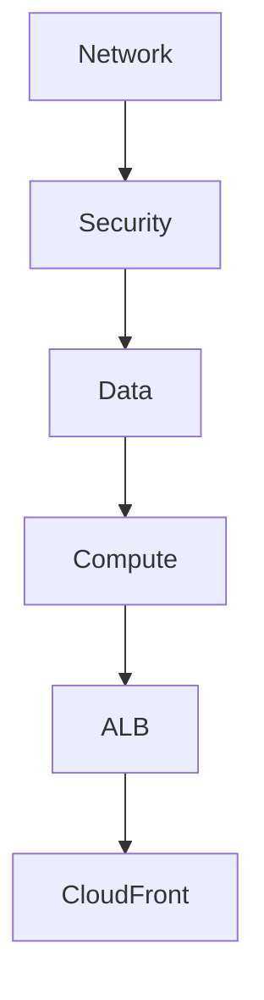

### Dependency Model

| Stack      | Depends On              |
| ---------- | ----------------------- |
| Network    | None                    |
| Security   | Network                 |
| Data       | None                    |
| Compute    | Network, Security, Data |
| ALB        | Network, Security       |
| CloudFront | ALB, Frontend S3 Bucket |

---

## CloudFormation Benefits

### Repeatable Deployments

Infrastructure can be recreated consistently without manual configuration.

### Reduced Configuration Drift

CloudFormation templates serve as the single source of truth for infrastructure.

### Modular Design

Individual stacks can be updated independently without affecting unrelated infrastructure.

### Infrastructure Version Control

Templates can be stored in Git repositories alongside application code.

---

# CI/CD

A CI/CD pipeline was intentionally excluded from this project to focus on understanding AWS infrastructure components and CloudFormation deployment workflows.

---

## Current Deployment Approach

Infrastructure and application updates are deployed manually.

### Current Workflow

```mermaid
flowchart LR

Developer
    --> CloudFormation

CloudFormation
    --> AWSInfrastructure

AWSInfrastructure
    --> ApplicationDeployment
```

### Benefits

- Better understanding of AWS resource relationships.
- Greater visibility into deployment dependencies.
- Easier troubleshooting during the learning phase.

---

## Future Enhancement

A future version of the project may implement automated CI/CD pipelines.

### Proposed Workflow

```mermaid
flowchart LR

GitHub
    --> GitHubActions

GitHubActions
    --> CloudFormation

CloudFormation
    --> AWSInfrastructure
```

### Potential Technologies

| Service          | Purpose                            |
| ---------------- | ---------------------------------- |
| GitHub Actions   | CI/CD automation                   |
| AWS CodePipeline | Managed deployment orchestration   |
| AWS CodeBuild    | Automated build and test execution |
| CloudFormation   | Infrastructure deployment          |

### Expected Benefits

- Faster deployments.
- Automated validation and testing.
- Reduced manual effort.
- Improved deployment consistency.

---

## Design Decisions

| Decision                   | Reason                                        |
| -------------------------- | --------------------------------------------- |
| Manual deployment first    | Improve understanding of AWS services         |
| CloudFormation adoption    | Automate infrastructure provisioning          |
| Modular stack design       | Improve maintainability                       |
| Separate deployment stages | Reduce deployment complexity                  |
| CI/CD deferred             | Prioritize infrastructure learning objectives |

The deployment approach was intentionally designed to balance hands-on AWS learning with infrastructure automation, allowing the project to progress from local development to a cloud-native architecture managed through Infrastructure as Code.

## Infrastructure as Code

Infrastructure as Code (IaC) was implemented using AWS CloudFormation to automate the provisioning and management of AWS resources.

Instead of manually creating infrastructure through the AWS Management Console, CloudFormation templates were used to define infrastructure as code. This approach enables repeatable deployments, reduces configuration drift, and provides a version-controlled method for managing cloud resources.

The infrastructure was designed using a modular stack architecture, where each stack is responsible for a specific layer of the application environment.

---

## CloudFormation Overview

AWS CloudFormation was selected as the Infrastructure as Code solution because it provides native AWS integration and supports declarative infrastructure definitions using YAML templates.

### Benefits of CloudFormation

| Benefit                        | Description                                                 |
| ------------------------------ | ----------------------------------------------------------- |
| Automation                     | Infrastructure can be provisioned automatically             |
| Repeatability                  | Consistent deployments across environments                  |
| Version Control                | Infrastructure definitions can be stored in Git             |
| Reduced Manual Configuration   | Eliminates repetitive console operations                    |
| Resource Dependency Management | CloudFormation automatically manages resource relationships |
| Standardization                | Ensures infrastructure is deployed consistently             |

---

## CloudFormation Architecture

The infrastructure was separated into multiple logical stacks. Each stack is responsible for a specific infrastructure layer and exports resources that can be reused by dependent stacks.

```mermaid
flowchart TD

Network
    --> Security

Network
    --> ALB

Network
    --> Compute

Security
    --> ALB

Security
    --> Compute

Data
    --> Compute

Data
    --> CloudFront

ALB
    --> Compute

ALB
    --> CloudFront
```

### Architecture Explanation

The CloudFormation architecture follows a layered design:

1. The Network stack creates foundational networking resources.
2. The Security stack creates Security Groups and IAM resources.
3. The Data stack provisions persistent storage resources.
4. The ALB stack creates traffic-routing components.
5. The Compute stack deploys application servers.
6. The CloudFront stack exposes the application through a global CDN.

---

## Stack Architecture

The infrastructure is organized into six CloudFormation stacks.

```text
01-network.yaml
02-security.yaml
03-data.yaml
04-compute.yaml
05-alb.yaml
06-cloudfront.yaml
```

### Stack Responsibilities

| Stack         | Purpose                                                       |
| ------------- | ------------------------------------------------------------- |
| 01-Network    | VPC, Public Subnets, Route Tables, Internet Gateway           |
| 02-Security   | Security Groups, IAM Role, IAM Instance Profile               |
| 03-Data       | DynamoDB Table and S3 Frontend Bucket                         |
| 04-Compute    | Launch Template, User Data Bootstrap, Auto Scaling Group      |
| 05-ALB        | Application Load Balancer, Listener, Target Group             |
| 06-CloudFront | CloudFront Distribution, Origin Access Control, Bucket Policy |

---

## Deployment Order

CloudFormation stacks must be deployed in a specific order because later stacks import values exported by earlier stacks.

### Deployment Sequence

```mermaid
flowchart LR

Network
    --> Security

Security
    --> Data

Data
    --> ALB

ALB
    --> Compute

Compute
    --> CloudFront
```

### Recommended Deployment Order

| Order | Stack              |
| ----- | ------------------ |
| 1     | 01-network.yaml    |
| 2     | 02-security.yaml   |
| 3     | 03-data.yaml       |
| 4     | 05-alb.yaml        |
| 5     | 04-compute.yaml    |
| 6     | 06-cloudfront.yaml |

### Why This Order Matters

The infrastructure relies heavily on CloudFormation exports and imports.

For example:

- Security imports the VPC ID from Network.
- Compute imports Security Groups from Security.
- Compute imports the Target Group ARN from ALB.
- CloudFront imports the ALB DNS Name.
- CloudFront imports the Frontend S3 Bucket Name.

Deploying stacks out of order would cause import failures because dependent resources would not yet exist.

---

## Cross-Stack References

CloudFormation Exports and Imports were used to share resources between stacks while maintaining stack independence.

This design allows infrastructure components to remain modular without requiring all resources to be defined in a single template.

---

### Example: Network to Security

Network Stack:

```yaml
Outputs:
  VpcId:
    Export:
      Name: recipe-cfn-vpc-id
```

Security Stack:

```yaml
VpcId: !ImportValue recipe-cfn-vpc-id
```

---

### Example: Security to Compute

Security Stack:

```yaml
Outputs:
  EC2SecurityGroupId:
    Export:
      Name: recipe-cfn-ec2-sg-id
```

Compute Stack:

```yaml
Groups:
  - !ImportValue recipe-cfn-ec2-sg-id
```

---

### Example: ALB to Compute

ALB Stack:

```yaml
Outputs:
  TargetGroupArn:
    Export:
      Name: recipe-cfn-target-group-arn
```

Compute Stack:

```yaml
TargetGroupARNs:
  - !ImportValue recipe-cfn-target-group-arn
```

---

### Example: Data to CloudFront

Data Stack:

```yaml
Outputs:
  FrontendBucketName:
    Export:
      Name: recipe-cfn-frontend-bucket-name
```

CloudFront Stack:

```yaml
BucketName: !ImportValue recipe-cfn-frontend-bucket-name
```

---

## Infrastructure Dependency Flow

The following diagram illustrates how resources depend on one another across stacks.

```mermaid
flowchart LR

VPC
    --> SecurityGroups

SecurityGroups
    --> LaunchTemplate

IAMRole
    --> LaunchTemplate

LaunchTemplate
    --> AutoScalingGroup

AutoScalingGroup
    --> TargetGroup

TargetGroup
    --> ALB

S3Bucket
    --> CloudFront

ALB
    --> CloudFront
```

---

## Modular Infrastructure Design

The infrastructure was intentionally separated into multiple stacks rather than using a single large CloudFormation template.

### Advantages

| Benefit                | Description                                              |
| ---------------------- | -------------------------------------------------------- |
| Easier Maintenance     | Individual stacks can be updated independently           |
| Faster Troubleshooting | Problems can be isolated to specific layers              |
| Reduced Complexity     | Smaller templates are easier to understand               |
| Improved Reusability   | Components can be reused in future projects              |
| Cleaner Architecture   | Infrastructure responsibilities remain separated         |
| Safer Updates          | Changes can be applied to specific infrastructure layers |

---

## Infrastructure Deployment Workflow

```mermaid
flowchart TD

Developer
    --> CloudFormationTemplates

CloudFormationTemplates
    --> AWSCloudFormation

AWSCloudFormation
    --> AWSResources

AWSResources
    --> ApplicationDeployment
```

### Workflow Explanation

1. Infrastructure is defined using YAML CloudFormation templates.
2. Templates are deployed through AWS CloudFormation.
3. CloudFormation provisions AWS resources automatically.
4. Resource outputs are exported and shared between dependent stacks.
5. Application components are deployed onto the provisioned infrastructure.

---

## Design Decisions

| Decision                | Reason                                            |
| ----------------------- | ------------------------------------------------- |
| CloudFormation          | Native AWS Infrastructure as Code service         |
| Modular Stack Design    | Simplifies management and maintenance             |
| Export / Import Pattern | Enables stack independence                        |
| YAML Templates          | Human-readable infrastructure definitions         |
| Automated Provisioning  | Reduces manual configuration effort               |
| Layered Architecture    | Improves organization and scalability             |
| Separate Data Layer     | Isolates storage resources from compute resources |

---

## Future Enhancements

Potential future improvements include:

- Nested CloudFormation Stacks
- CloudFormation StackSets
- AWS Systems Manager Parameter Store integration
- Environment-specific deployment templates
- GitHub Actions integration
- Automated infrastructure validation
- Migration to Terraform for multi-cloud infrastructure management

The current CloudFormation implementation provides a repeatable, automated, and modular foundation for deploying the Recipe Sharing App infrastructure while maintaining clear separation between networking, security, compute, storage, traffic management, and content delivery layers.

# Monitoring

Application availability was validated through:

- FastAPI health endpoint (/health)
- ALB Target Group health checks
- CloudFormation stack events
- AWS Console resource monitoring
- AWS CLI verification commands

CloudWatch dashboards and alarms were identified as future enhancements for production-grade monitoring.

# Troubleshooting

Start with browser network errors, backend logs, CORS configuration, and DynamoDB access patterns.
