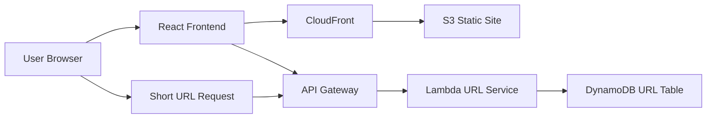

# Architecture

## Architecture Overview

Status: Planned / Documentation Placeholder

The planned URL Shortener architecture uses static frontend hosting and serverless API components. React provides the user interface, API Gateway receives create and redirect requests, Lambda runs application logic, DynamoDB stores URL mappings, and CloudFront/S3 deliver the frontend.

## System Flow

## Main Components

| Layer | Component | Responsibility |
| --- | --- | --- |
| Frontend | React | Form input, validation messages, result display |
| Delivery | S3 + CloudFront | Static hosting and CDN delivery |
| API | API Gateway | Public HTTP routes |
| Compute | Lambda | Create, lookup, redirect, and click tracking logic |
| Data | DynamoDB | Short code to destination URL mapping |

## Data Flow

1. A user submits a long URL from the React frontend.
2. API Gateway invokes Lambda.
3. Lambda validates the URL and generates or accepts a short code.
4. Lambda writes the mapping to DynamoDB.
5. A later short-code request looks up the mapping.
6. Lambda increments click count and returns a redirect response.

## Technology Stack

- React
- Vite
- Amazon S3
- Amazon CloudFront
- Amazon API Gateway
- AWS Lambda
- Amazon DynamoDB
- CloudWatch Logs

## Architecture Notes

The most important design decision is the DynamoDB key model. A simple version can use `shortCode` as the partition key. Future versions may add secondary indexes for owner, creation date, or expiration status.
