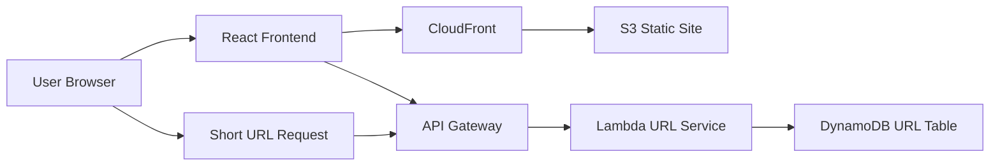

# Architecture

## Architecture Overview

Status: Planned / Documentation Placeholder

規劃中的 URL Shortener 架構使用 static frontend hosting 與 serverless API components。React 提供 UI，API Gateway 接收 create 與 redirect requests，Lambda 執行 application logic，DynamoDB 儲存 URL mappings，CloudFront/S3 交付 frontend。

## System Flow

## Main Components

| Layer | Component | Responsibility |
| --- | --- | --- |
| Frontend | React | 表單輸入、validation messages、結果顯示 |
| Delivery | S3 + CloudFront | Static hosting 與 CDN delivery |
| API | API Gateway | Public HTTP routes |
| Compute | Lambda | Create、lookup、redirect 與 click tracking logic |
| Data | DynamoDB | Short code 到 destination URL 的 mapping |

## Data Flow

1. User 從 React frontend 送出 long URL。
2. API Gateway invoke Lambda。
3. Lambda 驗證 URL，並產生或接受 short code。
4. Lambda 將 mapping 寫入 DynamoDB。
5. 後續 short-code request 會查詢 mapping。
6. Lambda 更新 click count 並回傳 redirect response。

## Technology Stack

- React
- Vite
- Amazon S3
- Amazon CloudFront
- Amazon API Gateway
- AWS Lambda
- Amazon DynamoDB
- CloudWatch Logs

## Architecture Notes

最重要的設計決策是 DynamoDB key model。簡單版本可以使用 `shortCode` 作為 partition key；後續版本可加入 owner、creation date 或 expiration status 的 secondary indexes。
