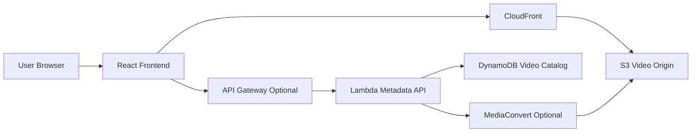

# Architecture

## Architecture Overview

Status: Planned / Documentation Placeholder

The planned architecture stores video files in S3 and delivers them through CloudFront. A React frontend displays the video catalog. Lambda can manage metadata and optional workflow triggers. MediaConvert can be added if transcoding is required.

## System Flow

## Main Components

| Layer | Component | Responsibility |
| --- | --- | --- |
| Frontend | React | Video catalog and playback UI |
| Storage | S3 | Original and processed video objects |
| Delivery | CloudFront | CDN delivery and cache behavior |
| API | API Gateway optional | Metadata or upload registration routes |
| Compute | Lambda optional | Metadata processing and workflow triggers |
| Processing | MediaConvert optional | Transcoding workflow |
| Metadata | DynamoDB optional | Video catalog records |

## Data Flow

1. A video object is stored in S3.
2. Optional metadata is written through an API.
3. Optional MediaConvert processing creates delivery-ready variants.
4. The frontend reads catalog metadata.
5. Users play video assets through CloudFront.

## Technology Stack

- React
- Vite
- Amazon S3
- Amazon CloudFront
- AWS Lambda optional
- Amazon API Gateway optional
- AWS Elemental MediaConvert optional
- Amazon DynamoDB optional

## Architecture Notes

The first version can focus on S3 and CloudFront delivery. Transcoding, signed URLs, DRM, and upload workflows should be treated as later phases because they introduce more operational and security complexity.
