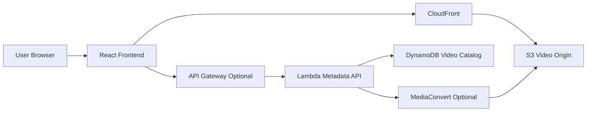

# Architecture

## Architecture Overview

Status: Planned / Documentation Placeholder

規劃架構將 video files 儲存在 S3，並透過 CloudFront deliver。React frontend 顯示 video catalog。Lambda 可管理 metadata 與 optional workflow triggers。若需要 transcoding，可加入 MediaConvert。

## System Flow

## Main Components

| Layer | Component | Responsibility |
| --- | --- | --- |
| Frontend | React | Video catalog 與 playback UI |
| Storage | S3 | Original 與 processed video objects |
| Delivery | CloudFront | CDN delivery 與 cache behavior |
| API | API Gateway optional | Metadata 或 upload registration routes |
| Compute | Lambda optional | Metadata processing 與 workflow triggers |
| Processing | MediaConvert optional | Transcoding workflow |
| Metadata | DynamoDB optional | Video catalog records |

## Data Flow

1. Video object 儲存在 S3。
2. Optional metadata 透過 API 寫入。
3. Optional MediaConvert processing 產生 delivery-ready variants。
4. Frontend 讀取 catalog metadata。
5. Users 透過 CloudFront 播放 video assets。

## Technology Stack

- React
- Vite
- Amazon S3
- Amazon CloudFront
- AWS Lambda optional
- Amazon API Gateway optional
- AWS Elemental MediaConvert optional
- Amazon DynamoDB optional

## Architecture Notes

第一版可以專注在 S3 與 CloudFront delivery。Transcoding、signed URLs、DRM 與 upload workflows 應視為後續 phase，因為它們會增加更多 operational 與 security complexity。
